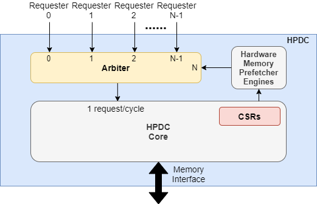
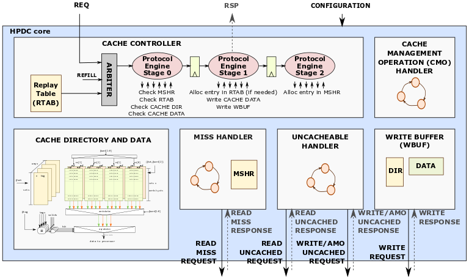

# Title of Project - "CORE-V L1 DCACHE"
# Project Launch Proposal
## Date of proposal

2022-05-03

## Author(s)

Cesar Fuguet - Research Engineer - CEA List (Grenoble)

## Summary of project

Many applications in the HPC (High-Performance Computing) domain (e.g.
scientific applications) are often memory bound: the performance bottleneck
is the memory. It is therefore necessary to implement cache subsystems
enabling a high memory throughput. This is to hide the continuously growing
gap between memory and processor cores speeds (“Memory Wall”).

We propose a High-Performance, Out-of-Order, Level-1 Data Cache (HPDC)
compatible with RISC-V processor cores. This HPDC was successfully
integrated with a CVA6 core (replacing its original Dcache). However,
it is meant to be compatible with other cores (with some modifications
in the load/store unit interface).

### Components of the Project

  - *Component 1:* Feature specification document
  - *Component 2:* High-Performance, Out-of-Order, L1 Dcache (HPDC) IP
  - *Component 3:* Hardware Memory Prefetcher IP
  - *Component 4:* UVM (Universal Verification Methodology) testbench for
    standalone (without core) testing of the HPDC

#### Component 1 Description

It is a specification document with a detailed description of the features
implemented in the HPDC, and the Hardware Memory Prefetcher. It also
contains a description of the micro-architecture.

#### Component 2 Description

This is the HPDC IP which is described in SystemVerilog RTL.

It is a High-Performance, Out-of-Order, Level-1 Data Cache (HPDC)
compatible with RISC-V processor cores, such as the CVA6.

Some of the features of the HPDC are:

  - Set-associative cache with configurable number of sets and ways.
  - Support of standard load, store, CMOs, and atomic operations of
    the RISC-V ISA.
  - Support of multiple independent requesters, such as, CORE-V cores
    and tightly couple accelerators.
  - Allow high and flexible bandwidth between this cache and the requesters.
    Current prototypes support up to 32 bytes/cycle between a given requester
    and this cache.
  - Supports a high (configurable) number of miss requests to the memory.
  - Write-through cache with a write-buffer for write data coalescing and
    multiple inflight write
  - Adapter for the AMBA AXI5 interface on the NoC/Memory interface of
    this cache.
  - Pipelined micro-architecture to achieve high clock frequencies and
    high throughput.
  - Allow out-of order execution of memory operations to avoid unnecessary
    stalls. Compliance with the RISC-V Weak Memory Ordering Consistency
    Model (RVWMO).

#### Component 3 Description

This is the Hardware Memory Prefetcher IP which is described in SystemVerilog RTL.

It is a programmable memory profetcher that implements up to 4 independent engines.
These engines allow to prefetch strided memory buffers into the cache. This is to
anticipate actual accesses from the application, increase the cache hit rate, and
thus the performance.

#### Component 4 Description

This is a SystemVerilog testbench, that follows the Universal Verification
Methodology (UVM), and that allows to verify the HPDC and the Hardware Memory
Prefetcher IPs.

This testbench allows standalone verification of these IPs, this is, the
verification is performed without any core or accelerator. Hereafter a list of
features of this testbench:

  - Request agents that generate sequences of requests to the HPDC:
    loads, stores, CMOs or AMOs. Sequences can be directed or random.
  - Memory response model with out-of-order delivery of responses, able to send
    error responses, and that can apply back-pressure to requests or variable delays
    to responses.
  - Scoreboard for the automatic verification of outputs from the HPDC and the Hardware
    Memory Prefetcher.

## Summary of market or input requirements
### Known market/project requirements at PL gate

  - Hardware RISC-V based accelerators in the HPC domain.

  - We (CEA) are already using this HPDC for our custom RISC-V based
    hardware accelerator: the VRP/VxP (Variable and eXtended precision
    accelerator). This accelerator is and will be taped-out in:
    
      - GlobalFoundaries 22FDX technology in the framework of the
        European Processor Initiative (EPI) EPAC1.5 test-chip.
        Taped-out on November, 2022.
        Expected date for the chips to be back: March, 2023.
      - TSMC 7nm technology in the framework of the EPI’s RHEA chip
        Tape-out on June, 2023.
        Expected date for the chips to be back: October, 2023.
        
### Potential future enhancements for future project phases

Future developments may add features such as

  - Support of one or multiple cache-coherency protocols.
  - Memory error correction (ECC) for complying with constraints in
    critical systems
  - Hybrid write-policy: write-back / write-through.
  - Scratchpad mode (partially or fully). Useful in some embedded
    systems or even HPC for some accelerators.
  - System testing to be determined by other interested parties.

## Who would make use of OpenHW output

The proposed HPDC should be adaptable to any RISC-V processor core
in HPC domain. Therefore, it could benefit anyone needing a high-throughput
for memory accesses.

## Summary of Timeline

  - Feature specification document
    - November, 2022 - First draft released.
    - Q1, 2023 - Another release after external review.
  -	HPDC, Hardware Memory Prefetcher and UVM testbench
    -	Q2, 2023 – Cache + Prefetcher + Initial UVM TB,
      initial test-plan, limited design configurations, no performance testing.
    -	Q4, 2023 – Cache + Prefetcher + updated test-plan, with verification
      90% testplan complete (including assertions, performance testing),
      operating in multiple configurations
    -	Q1, 2024 - Cache + Prefetcher + final test-plan,
      with 100% verification, broad set of design configurations

## Explanation of why OpenHW should do this project
  
  - This HPDC enables high-performance on memory bound applications
    and it is adaptable to RISC-V cores in the OpenHW Cores-V portfolio.
  - This project will help to extend the CVA6 ecosystem for next
    generation of CVA6 cores which need more capable cache.
  - First move for OpenHW into HPC
  - Deepen engagement of key EU research organizations (such as CEA)
    with OpenHW projects

## Industry landscape: description of competing, alternative, or related efforts in the industry

Hereafter some of the features of other open-source, RISC-V compatible,
L1 Data Caches.

<table style="width:94%;">
<colgroup>
<col style="width: 23%" />
<col style="width: 23%" />
<col style="width: 23%" />
<col style="width: 23%" />
</colgroup>
<thead>
<tr class="header">
<th><strong>Features</strong></th>
<th><strong>CVA6 NonBlocking Dcache</strong></th>
<th><strong>Rocket/BOOM NonBlocking Dcache</strong></th>
<th><strong>This project</strong></th>
</tr>
</thead>
<tbody>
<tr class="odd">
<td><strong>HDL (Hardware Description Language)</strong></td>
<td>SystemVerilog</td>
<td>Chisel (Scala)</td>
<td>SystemVerilog</td>
</tr>
<tr class="even">
<td><strong>MSHR (Miss Status Holding Register)</strong></td>
<td>Implemented in FFs. Up to 1 miss per requester.</td>
<td>Implemented in FFs. Configurable. Up to 32 requests (to stay under 2Kbits).</td>
<td>Implemented in RAM. Up to 128 requests (or more).</td>
</tr>
<tr class="odd">
<td><strong>Hardware Memory Prefetcher</strong></td>
<td>No</td>
<td>No</td>
<td>Yes</td>
</tr>
<tr class="even">
<td><strong>Hardware Cache Coherency</strong></td>
<td>Yes (using OpenPiton)</td>
<td>Yes (using Tilelink)</td>
<td>No. We plan to support hardware cache coherency in a future release.</td>
</tr>
<tr class="odd">
<td><strong>Req Data Width</strong></td>
<td>32, 64</td>
<td>-</td>
<td>Any power of 2, up to 256 bits</td>
</tr>
<tr class="even">
<td><strong>Memory Order</strong></td>
<td>All memory accesses are issued in order. In case of match with MSHR, the requester is stalled.</td>
<td>-</td>
<td>Only memory accesses on the same address are issued in order. In case of match, the request is put in a replay table to be issued later. The requester is not stalled.</td>
</tr>
<tr class="odd">
<td><strong> Write-Policy</strong></td>
<td>
Write-Back

Write-Through
</td>
<td>Write-Back</td>
<td>Write-Through</td>
</tr>
</tbody>
</table>

## OpenHW Members/Participants committed to participate

## Project Leader(s)

### Technical Project Leader(s)

Cesar Fuguet - Research Engineer - CEA List (Grenoble)

## Project Documents

  - PL document (this document)
  - Feature specification document of the HPDC and the Hardware Memory Prefetcher IP.

## List of project technical outputs

This is a list of technical artifacts produced by the project

  - Feature specification document of the HPDC and the Hardware Memory Prefetcher IP
  - RTL (SystemVerilog) sources of the HPDC IP.
  - RTL (SystemVerilog) sources of the Hardware Memory Prefetcher IP.
  - UVM (SystemVerilog) testbench for standalone testing of the HPDC.
  - Verification test-plan.
  - README files with instruction of the environment setup and utilization.

## External dependencies
*These are external factors on which the project depends, such as external standards ratification, external technology input, etc.*

## OpenHW TGs Involved
Cores, and Verification TWG

## Resource Requirements

### Engineering resource supplied by members - requirement and availability

César Fuguet (CEA List, Grenoble, France) –
Designer of the HPDC and the Hardware Memory Prefetcher.

Adrian Evans (CEA List, Grenoble, France) –
Principal responsible of verification.

Tanuj Khandelwal (CEA List, Grenoble, France) –
Verification engineer.

### OpenHW engineering staff resource plan: requirement and availability

Participation for specification and verification plan reviewing welcomed.

### Marketing resource  - requirement and availability

NA

### Funding for project aspects - requirement and availability 

NA

## Architecture and/or context diagrams 

## Project license model

Permissive open-source licence.

## Repository Requirements

  - Separate repository for the HPDC that will also include the Hardware Memory Prefetcher
    and the dedicated UVM testbench.

## Project distribution model

  - OpenHW GitHub Repository

## Preliminary Project plan
*A full project plan is not required at PL. A preliminary plan, which can be for instance the schedule for completion of component or feature list, together with responsible resource, should be provided. Full details should be provided at PA gate.*

## Risk Register
*A list of known risks, for example external dependencies, and any mitigation strategy*
