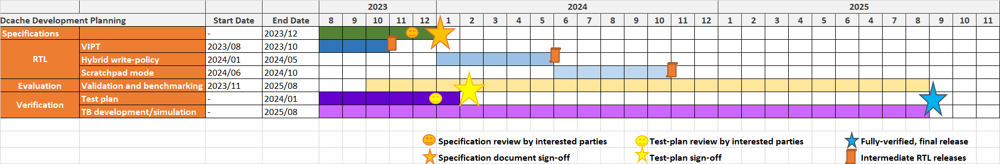

# OpenHW Plan Approve

## Title of Project
*CORE-V L1 DCACHE (HPDcache)* - High-Performance L1 Data-Cache for Core-V RISC-V cores.

## Date of proposal

September 25th, 2023

## Author(s)

César Fuguet - Research-Engineer at CEA List (Grenoble) - <cesar.fuguettortolero@cea.fr>

## TRL target

| Core produced and verified in this project | TRL Target    | Comment  |
| ----------------------------------------   | ------------- | -------- |
| CORE-V L1 Dcache - HPDcache                | 7             |          |

## Release plan

| Release number         | Planned date          | Description                                             |
| ---------------------  | --------------------  | ---------------------                                   |
| 1.0.0                  | 2023-28-02            | Initial release                                         |
| 2.0.0                  | 2023-18-09            | Current version in OpenHW Github                        |
| 3.0.0                  | 2023-31-10            | Add VIPT support                                        |
| 4.0.0                  | 2024-31-03            | First release of the HPDcache's  UVM testbench          |
| 4.1.0                  | 2024-31-05            | Add write-through/write-back hybrid write policy        |
| 4.2.0                  | 2024-31-10            | Add scratchpad mode.                                    |
| 4.3.0                  | 2025-31-08            | Final release, TRL7 fully-verified                      |

*VIPT: virtually-indexed, physically-tagged addressing*

Starting from release 4.0.0, the associated UVM verification testbench will be released in its dedicated Github repository.

**These developments are to a great extent funded by the European KDT JU Tristan project (which started in December, 2022 and ends in December, 2025). The previous release plan is aligned with our engagements for the KDT JU Tristan project.**

## Project deliverables (high level)

| Deliverable           | Description                     | Technical Leader        |
| --------------------  | ------------------------------  | ---------------------   |
| Item1                 | RTL code                        | César Fuguet            |
| Item2                 | Specifications document         | César Fuguet            |
| Item3                 | Verification Test plan          | Tanuj Khandelwal        |
| Item4                 | Verification UVM testbench code | Tanuj Khandelwal        |

## Feature List

A preliminary specification document can be found at: [Specification Document](https://github.com/openhwgroup/cv-hpdcache/blob/master/docs/hpdcache_spec_document/release/hpdcache_spec-1.0.0-draft.pdf)

Hereafter a high-level list of features:

 - Set-associative cache with configurable number of sets and ways.
 - Support of standard load, store, CMOs, and atomic operations of the RISC-V ISA.
 - Support of a configurable number of multiple independent requesters such as CORE-V cores and tightly couple accelerators.
 - Allow high and flexible bandwidth between this cache and the requesters (configurable from 4 to 64 bytes/cycle between a given requester and this cache).
 - Supports a high (configurable) number of miss requests to the memory.
 - Write-buffer for write data coalescing and multiple inflight writes (configurable) to the memory.
 - Pipelined micro-architecture to achieve high clock frequencies and high throughput.
 - Allow out-of order execution of memory operations to avoid unnecessary stalls.
 - Hybrid write-policy: write-back / write-through.
 - Scratchpad mode (partially or fully). Useful in some embedded systems or even HPC for some accelerators.
 - Adapter for the AMBA AXI5 interface on the NoC/Memory interface of this cache.
 - A dedicated standalone UVM testbench. This testbench verifies the HPDcache in an environment where the core(s) and the memory are implemented by verification synthetic agents.

As a proof of concept, the HPDcache will be integrated with the [CVA6 core](https://github.com/openhwgroup/cva6). The HPDcache will support both 32 and 64-bit variants of this core.

## Resources/ Resource Plan
*Members (organizations) and individuals committed to work on the project should be listed in this section*
*The following table is provided as an example*

| Organization              | Person                          | Project deliverable focus     |
| --------------------      | ------------------------------  | ----------------------------  |
| CEA List (Grenoble)       | César Fuguet                    | RTL, specification document   |
| CEA List (Grenoble)       | Tanuj Khandelwal                | Verification Test-Plan and TB |
| CEA List (Grenoble)       | Ludovic Pion                    | Verification Test-Plan and TB |
| CEA List (Grenoble)       | Adrian Evans                    | Verification Test-Plan and TB |
| OpenHW Group              | Member of the verification team | Test plan review              |
| OpenHW Group / Partner    | Verification/designer person    | Specification document review |

 ## Project Leadership Roles

| Role                        | Person                | Organization            | Committer Status      |
| --------------------        | --------------------  | --------------------    | --------------------  |
| Technical Project Leader(s) | César Fuguet          | CEA List (Grenoble)     | Elected               |

## Work Breakdown Structure

| Task                       | Subtask               | Start Date    | End Date     |
| -------------------------  | --------------------  | ------------  | -----------  |
| **Specification document** |                       | 2023/09       | 2023/12      |
| **RTL**                    |                       | 2023/09       | 2024/10      |
|                            | *VIPT*                | 2023/09       | 2023/10      |
|                            | *Hybrid write-policy* | 2024/01       | 2024/05      |
|                            | *Scratchpad mode*     | 2024/06       | 2024/10      |
| **Validation/Evaluation**  |                       | 2023/10       | 2025/08      |
|                            | *Software drivers*    | 2023/10       | 2025/08      |
|                            | *Validation*          | 2023/10       | 2025/08      |
|                            | *Benchmarking*        | 2023/10       | 2025/08      |
| **Verification**           |                       | 2023/09       | 2025/08      |
|                            | *Test-Plan*           | 2023/09       | 2024/01      |
|                            | *TB dev/simulation*   | 2023/09       | 2025/08      |

**We would like to ask members of the OpenHW Group to review both the specification document and the verification test-plan. Expected dates for the call for review are November, 2023 for the specifications document and January, 2024 for the verification test-plan.**

## Schedule

## Project Repo

 - [OpenHW Github HPDcache Repository](https://github.com/openhwgroup/cv-hpdcache)
 - [README](https://github.com/openhwgroup/cv-hpdcache/blob/master/README.md)
 - [LICENSE](https://github.com/openhwgroup/cv-hpdcache/blob/master/LICENSE) - Solderpad Hardware License v2.1
 - **TODO**: Additional dedicated Git repository for the HPDcache's UVM testbench

## Regular Project Meeting
*The project should have a regular project meeting established and included on the OpenHW calendar. Send a recurring meeting request to meetings@openhwgroup.org*

Most of the RTL, documentation, validation/evaluation and verification activities are made by CEA staff. However, if third parties are interested to follow the status, comment and contribute, we can setup either occasional meetings or regular monthly meetings.

Either way, the status reporting of this project could be made at some regular basis in the future OpenHW Interconnect TWG meetings.

## Regular Project Report
*The project should have a regular project meeting report agreed. The format of the report should follow the suggestion in the programs/template repo. Consult OpenHW staff as meeting report location*.

To be defined

## Risk Register

| Risk                          | Description                           | Plan to Mitigate Risk       |
| --------------------          | --------------------                  | --------------------        |
| Risk1                         | Resources unavailability              | Shift release dates         |
| Risk2                         | Important changes in CVA6 interfaces  | Shift release dates         |

## Checklists to pass the Project Finished/Project Release Gate
*The checklists which will be used to gate the completion of the project should be listed. The checklists themselves don't need to be presented at the PA gate. Steps to create them should be described.*

| Checklist                     | Description                       | Plan to Develop Checklist               |
| --------------------          | --------------------------------  | --------------------                    |
| Documentation Complete        | Check that all features and the micro-architecture are correctly detailed   | (1) consolidate features list; (2) review checklist with interested parties |
| RTL Freeze                    | Check that all features are implemented and fully verified                  | (1) boot up from the RTL checklist of the OpenHW group; (2) review internally and modify it if necessary                                |
| Verification Complete         | Check that all features are correctly covered by the test-plan and verified | |

## PA Checklist

*Confirm in the table below that each listed item is completed, or explain the exception/waiver*

| Item                          | Completion (Y/N/In progress/NA)   | Comment                               |
| --------------------          | --------------------              | --------------------                  |
| Project Concept Complete      | Y                                 | [PC](https://github.com/openhwgroup/programs/blob/master/Project-Descriptions-and-Plans/CORE-V-L1-DCACHE/20220523-OHG-ProjectConcept-CEA_L1_Dcache.md) |
| Project Launch Complete       | Y                                 | [PL](https://github.com/openhwgroup/programs/blob/master/Project-Descriptions-and-Plans/CORE-V-L1-DCACHE/20221214-ProjectLaunch-CEA_L1_Dcache.md) |
| SW Target platform identified | NA                                |                                       |
| Cores Part Number identified  | NA                                |                                       |
| Cores TRL Target identified   | Y                                 | TRL7                                  |
| Project release plan identified | Y                               |                                       |
| HL Project deliverables identified| Y                             |                                       |
| Feature list available        | Y                                 |                                       |
| Resource plan available       | Y                                 |                                       |
| Repo setup                    | Y                                 |                                       |
| License.md file in place      | Y                                 |                                       |
| Project Manager identified    | Y                                 |                                       |
| Technical Project Leader per deliverable identified| Y            |                                       |
| At least 1 project committer elected| Y                           |                                       |
| Work Breakdown Structure available | Y                            |                                       |
| Baseline schedule available   | Y                                 |                                       |
| Ongoing schedule tracking identified  |                           |       e.g. Github project board       |
| Regular project meeting setup | N                                 |                                       |
| Project Monthly report format agreed  | N                         |                                       |
| Risk Register available | Y                                       |                                       |
| Set of Project Freeze/Release Checklists identified | Y           |                                       |
