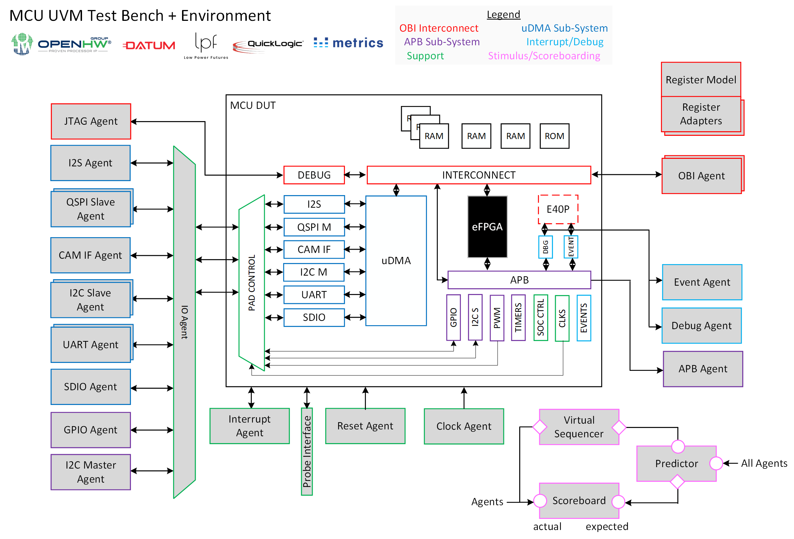

## Title of Project 
CORE-V MCU UVM Environment & Test Bench

## Date of proposal
2024-04-22
## Author(s)
David Poulin - Datum Technology Corporation

## Release plan

| Release number		    | Planned date						| Description															| 
| --------------------- 	| --------------------- 			| ---------------------													| 
| 1.1.0						| 2024-12-05						| Deliver MCU UVM Environment & Test Bench as well as UART tests simulating with Metrics DSim.					|

## Project deliverables (high level)

| Deliverable		    | Description			| Technical Leader		| 
| --------------------- | --------------------- | ---------------------	| 
| uvme_cvmcu_chip	    			| CORE-V-MCU UVM Environment including Register Model				|		David Poulin				|
| uvmt_cvmcu_chip	    			| CORE-V-MCU UVM Test Bench	|			David Poulin			|
| uvma_cvmcu_cpi	    			| CORE-V-MCU Camera Port Interface UVM Agent			|			David Poulin			|
| uvma_cvmcu_event	    			| CORE-V-MCU Core Event UVM Agent	|			David Poulin			|
| uvma_cvmcu_dbg	    			| CORE-V-MCU Core Debug UVM Agent	|			David Poulin			|

## Feature List
* An industrial-grade UVM verification environment & test bench that can:
> * Fully verify the CORE-V MCU peripherals and connectivity to TRL-5.
> * Be extended to verify future versions of the MCU including devices with new/different peripherals and topology.
> * Support a self-checking environment using extensible prediction and scoreboarding components.
> * Replace the core with UVM bus agent(s) (e.g. OBI) to drive stimulus and collect responses sufficient to achieve above.
* Ability to simulate with Metrics DSim
* Ability to drive and receive data from both the core and IO pins for UART peripherals

 
## Resources/ Resource Plan

| Organization					| Person							| Project deliverable focus 			|      
| --------------------    		| --------------------    			| -------------------- 					|
| Datum Technology Corporation	    			| David Poulin					  		|	Verification						|

 
 
 ## Project Leadership Roles

| Role									| Person							| Organization							| Committer Status						|       
| --------------------    				| --------------------    			| -------------------- 					| -------------------- 					| 
| Project Manager(s) (if applicable)	| 				Mike Thompson	  				|				OpenHW Group						|										| 
| Technical Project Leader(s)	    	| 					David Poulin  				|					Datum Technology Corporation					|										| 

## Work Breakdown Structure

* Write Verification Plan
* Capture MCU Register Model using Datum UVMxGen spreadsheet notation
* Capture DV specs using Datum UVMxGen spreadsheet notation
* Generate UVM code using UVMxGen
* Run automated register tests via OBI frontdoor access using Metrics DSim
> * Hardware Reset values checks (reg_hw_reset)
> * Register model vs. RTL equivalency check (reg_bit_bash)
> * Memory consistency check (mem_walk)
* Generate Doxygen reference documentation of all UVM code using Datum's Moore.io CLI

## Schedule

* Verification Plan: Finished
* DV Specs: 2024/04/24
* Register Model capture: 2024/06/15
* Generate UVM code: 2024/06/15
* Run automated register access tests for UART & uDMA: 2024/06/22
* UART egress sequences: 2024/08/15
* UART ingress sequences: 2024/09/31
* Implement CPI agent sequences: 2024/10/31
* Generate Doxygen documentation: 2024/12/01
* Review with OpenHW Group members: 2024/12/05

## Project Repo 
https://github.com/openhwgroup/core-v-mcu-uvm

## Regular Project Meeting 
Wednesdays at 2pm EST

## Regular Project Report
*The project should have a regular project meeting report agreed. The format of the report should follow the suggestion in the programs/template repo. Consult OpenHW staff as meeting report location*.

## Risk Register

| Risk							| Description						| Plan to Mitigate Risk					|      
| --------------------    		| --------------------    			| -------------------- 					|
| MCU register model inaccuracies	    					| 					RTL vs. User Manual description  				|										|

## Checklists to pass the Project Finished/Project Release Gate
*The checklists which will be used to gate the completion of the project should be listed. The checklists themselves don’t need to be presented at the PA gate. Steps to create them should be described.*

| Checklist						| Description						| Plan to Develop Checklist					|      
| --------------------    		| --------------------    			| -------------------- 					|
| Verification Components Complete	    	| 				All UVM components are simulating using DSim and checked in.	  				|										|
| Documentation Complete    	| 				Verification Plan and reference documentation complete and checked in.	  				|										|

## PA Checklist

*Confirm in the table below that each listed item is completed, or explain the exception/waiver*

| Item							| Completion (Y/N/In progress/NA)	| Comment							|      
| --------------------    		| --------------------    			| -------------------- 					|
| Project Concept Complete	    | 				Y  				|										|
| Project Launch Complete	    | 					 Y 				|										|
| SW Target platform identified	| 					N/A  				|										|
| Cores Part Number identified	| 					N/A  				|										|
| Cores TRL Target identified	| 				N/A  				|										|
| Project release plan identified | 					  			|										|
| HL Project deliverables identified| 				Y	  			|										|
| Feature list available|	Y	| 					  				|										|
| Resource plan available|	Y	| 					  				|										|
| Repo setup|		Y			| 					 				|										|
| License.md file in place		| 					  				|										|
| Project Manager identified	| 				Y  				|										|
| Technical Project Leader per deliverable identified| 				Y  			|										|
| At least 1 project committer elected| 					  		|										|
| Work Breakdown Structure available | 				Y  			|										|
| Baseline schedule available	| 				Y  				|										|
| Ongoing schedule tracking identified 	| 			|		Github project board							|
| Regular project meeting setup	| 					  				|										|
| Project Monthly report format agreed	| 					  				|										|
| Risk Register available | 					  			|										|
| Set of Project Freeze/Release Checklists identified | 					  		|							|
