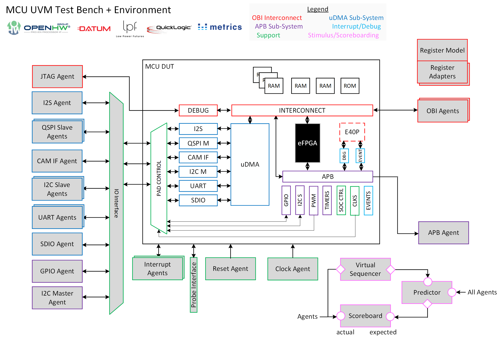

# CORE-V MCU UVM Environment & Test Bench
# Project Launch Proposal
## Date of proposal - 2024-04-22
## Author(s) - David Poulin (Datum Technology Corporation)

## Summary of project

### Components of the Project
* Verification Plan
* UVM Register Model
* UVM Test Bench
* UVM Environment
* CPI UVM Agent
* Doxygen documentation of all above

## Summary of market or input requirements
### Known market/project requirements at PL gate
Within the OpenHW Group community, there is interest in MCU devices for the CORE-V family of cores and related IP.  At this time, the OpenHW Group community lacks the ability to take a CORE-V-MCU type device to TRL-5.

### Potential future enhancements for future project phases
Augment the UVM environment to encompass projects such as the CORE-V CVA6-Platform.

## Who would make use of OpenHW output
Anyone who wants a TRL-5 CORE-V-MCU type device.

## Summary of Timeline
* Verification Plan: 2024/04/31
* UVM Register Model: 2024/06/15
* UVM Test Bench & Environment: 2024/09/31
* CPI UVM agent: 2024/10/31
* Doxygen documentation: 2024/12/01

## Explanation of why OpenHW should do this project
The industry standard for bringing digital designs to TRL-5 is through the Universal Verification Methodology (UVM).  The OpenHW Group is a long-time user of UVM for the CORE-V verification projects.  There is currently no UVM Test Bench for the CORE-V-MCU.

## Industry landscape: description of competing, alternative, or related efforts in the industry
The current testing platform for the CORE-V-MCU is the CORE-V-MCU-CLI, which is a processor driven approach to writing C++ test cases that has been shown to have low coverage.

## OpenHW Members/Participants committed to participate
* Datum Technology Corporation

## Project Leader(s)
### Technical Project Leader(s)
* David Poulin - Datum Technology Corporation
 
### Project Manager, if a PM is designated
* Duncan Bees - OpenHW Group

## Project Documents
### Project Planning Documents
* Verification Plan - within GIT repository (Markdown)
* Design Verification Specifications - within GIT repository (Open Office Documents)

### Project Output Documents
* Doxygen code documentation (HTML)

## List of project technical outputs
* UVM Register Model
* UVM Test Bench
* UVM Environment
* CPI UVM Agent & Self-Test Bench

### Feature Requirements
* Automated register access tests for UART & uDMA
* MCU Predictor
* MCU Scoreboards
* UART egress sequences
* UART ingress sequences
* CPI agent sequences

## External dependencies
Availability of the Metrics DSim Desktop simulator.

## OpenHW TGs Involved
* HW TG
* Verification TG

## Resource Requirements

### Engineering resource supplied by members - requirement and availability
* David Poulin - Datum Technology Corporation
  
### OpenHW engineering staff resource plan: requirement and availability
* Mike Thompson
* Duncan Bees

### Marketing resource  - requirement and availability
None

### Funding for project aspects - requirement and availability
None. Making use of free Metrics DSim Desktop simulator.

## Architecture and/or context diagrams 

## Project license model
* Open-Source code: SolderPad 2.1
* Datum UVM VIPs - Closed-source & proprietary, license provided to OpenHW Group employees.

## Repository Requirements
Single GitHub repository: https://github.com/openhwgroup/core-v-mcu-uvm

## Project distribution model
GitHub repository and releases using Semantic Versioning.

## Preliminary Project plan
* Verification Plan: Finished
* DV Specs: 2024/04/24
* Register Model capture: 2024/06/15
* Generate UVM code: 2024/06/15
* Run automated register access tests for UART & uDMA: 2024/06/22
* UART egress sequences: 2024/08/15
* UART ingress sequences: 2024/09/31
* Implement CPI agent sequences: 2024/10/31
* Generate Doxygen documentation: 2024/12/01
* Review with OpenHW Group members: 2024/12/05

## Risk Register
* Metrics DSim simulator availability.  Alternative is Xilinx Vivado.

