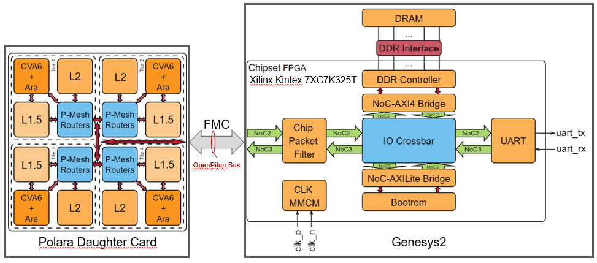
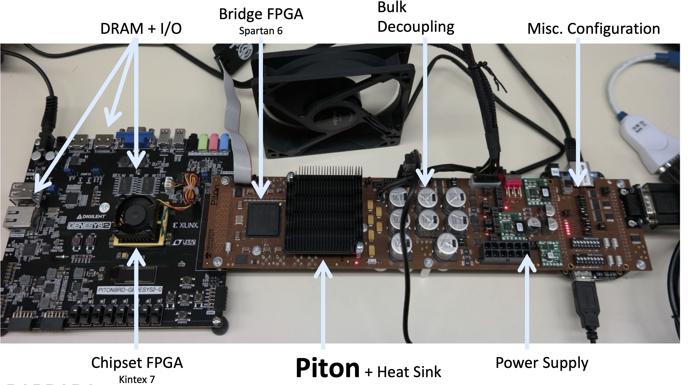

# OpenHW CORE-V POLARA Dev-Kit Project Concept Proposal

# Title of Project - "CORE-V Polara DevKit"
# Project Concept Proposal
## Date of proposal - 2023-10-25
## Author(s)
- François Leduc-Primeau, Polytechnique Montreal 
- Mike Aronson, Rumble Dev
- Duncan Bees, OpenHW

## High Level Summary

The project aim is to develop and produce a DevKit board to receive
the CORE-V Polara device after fabrication and packaging. Following
the example of the CORE-V MCU DevKIt, the CORE-V Polara DevKit will be
developed in open source contributions, and will be sold and
distributed by OpenHW via distribution partners to any non-prohibited
OpenHW member.

## Market/Driving Requirements at PC Gate

CORE-V Polara provide an advanced architecture including CVA6,
CV-MESH, and CV-VEC.  The DevKit provides the hardware support to
allow application and algorithm developers to develop, prototype, and
bench Polara applications. The DevKit will provide basic I/O
capabilities via a Digilent Genesys2 FPGA board. Furthermore, by
extending the FPGA system or by replacing the FPGA board, users can
easily extend the DevKit to support other types of I/O or memory.

## Feature Requirements at PC Gate

The following project feature list is preliminary and will be refined as we move forward through the OpenHW Gate process.
- Powered by bench power supply
- Bare Metal software testing environment targeting CVA6 and CV-VEC
- Linux implementation with development environment supported by CVA6-SDK
- Interconnect with OpenPiton “Chipset” FPGA board [1]

## Initial Block Diagram

A high level block diagram of the system is shown below:

For additional context, the following shows a previous OpenPiton system with a similar arrangement:

Salient points:
- The Chipset FPGA, DRAM and I/O are contained on an external FPGA board (the “Chipset FPGA board”).
- The Chipset FPGA will be developed for a Digilent Genesys2 board, although support for other FPGA boards could be added later.
- The Polara chip would be placed on the Polara daughter board along with minimal interface logic to the Chipset FPGA board. 
- The Power supply is external to the Polara daughter board.

## Project Outputs and Who Would Make Use of Them

### Project Outputs

OpenHW’s project outputs would comprise:
1. Open-source schematics and board layout files for the DevKit Polara host board which live in OpenHW repos
1. Interface specification from the Polara host board to the Chipset FPGA board. Note that this interface takes the form of the Open Piton Bus
1. Open-source FPGA project implementing the Chipset. Note that is is already available from Jonathan Balkind’s team but will be refined for this project. 
1. DevKit User Manual
1. Open source software as required to implement low level testing of Polara
1. Open source software as required to support application development from the CVA6-SDK perspective. 

### Users of the Project Outputs

*OpenHW members and staff.* Members developing Polara and related projects along with staff would use the DevKit for:
- Polara bringup
- Polara functionality testing
- Support of Vector use-case testing for related projects such as CVA6-Platform
- Demonstration of Vector processing applications

*Application Developers.* Members would use the DevKit for:
- Evaluation of CV-VEC / CVA6 handling of Vector Processing 
- Development and testing of Vector processing software

## Initial Estimate of Timeline

October 2023: Project Concept proposal 

November 2023: Project Launch
- Refining the project definition, for example clarifying the tradeoff of the DevKit between “extremely simple for Polara bringup” vs “more fully featured for application development and CV-VEC evaluation”
- Making sure sw resources are onboard
- Having people assigned to all the major roles

December 2023: Polara tape-out (MPW2257)

February 2024
- Plan Approved providing a project plan until Project Freeze (i.e. the first releases of each variant) and detailed feature specification as part of the User Manual
- Host board schematics

March 2024:
- Host board layout
- Finish FPGA chipset development

May 2024: Polara delivery (MPW2257)

## Explanation of why OpenHW should do this project

As the developer of the CV-VEC and CVA6, as well as the Polara chip, OpenHW is clearly the appropriate organization to develop the CORE-V Polara DevKit.

The DevKit will play a key role in expanding the ecosystem development around CV-VEC and CVA6.

It will be a key enabler for the CORE-V VISION APU project as well.

## Industry landscape: description of competing, alternative, or related efforts in the industry

The following describes the Openpiton framework:

[1] J. Balkind, et al. Openpiton: An open source manycore research framework. In Proceedings of the Twenty-First International Conference on Architectural Support for Programming Languages and Operating Systems, ASPLOS ’16, pages 217–232, New York, NY, USA, 2016. ACM.

## OpenHW Members/Participants committed to participate

- Polytechnique Montreal 
- UCSB
- Rumble Dev
- Empaiot

Specific roles to be outlined in the Project Launch.

## Project Leaders

### Technical Project Leader(s)
- François Leduc-Primeau: technical management
- Jonathan Balkind: Open Piton expert
- Mike Aronson: technical consultant (board specifications, application support)
- Alfred Shiu: management of the board layout

### Project Manager, if a PM is designated
TBD

## Next steps/Investigation towards Project Launch 

- Finalize scope/concept of the DevKit
- Determine feature list in more detail as suited to PL and begin to consider a project plan that will be reviewed in the PA gate.
- Determine scope of software to be developed within OpenHW 
- Determine external dependencies
- Determine project participants and each one’s role
- Determine/establish required repos and IP licenses to be used
- Determine promotion/marketing plan to support this project and increase its visibility both within OpenHW and externally
- Determine exactly who can acquire a DevKit supplied by OpenHW.

## Target Date for PL
November, 2023

