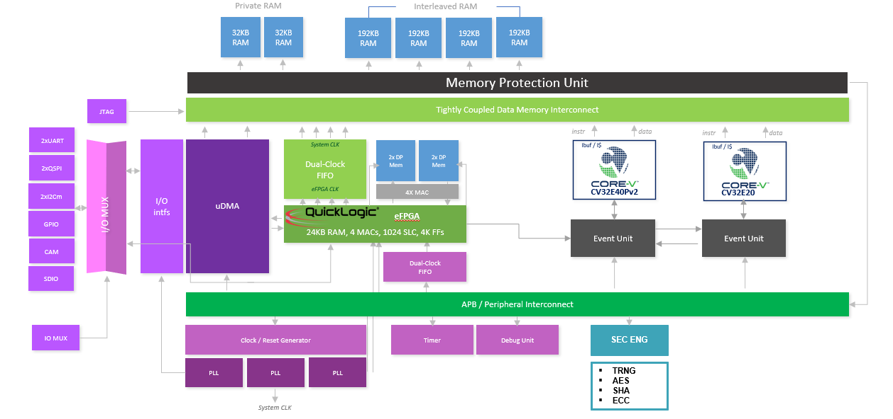

# OpenHW Preliminary Project Proposal
https://mattermost.openhwgroup.org/

# Title of Project

CORE-V MCU2 SoC

## Summary of project

This project builds upon the OpenHW CV32E40Pv2, the CV32E20 cores, the core-v-mcu, and Low Power Futures' security engine to design and fabricate an evaluation SoC that will be delivered in an evaluation kit.
Key goals of this project are
1. A TRL5 SoC that people can customize for their own products
2. Incorporate Low Power Futures' security engine to enable the platform level security required by new devices such as defined by [Matter]https://csa-iot.org/wp-content/uploads/2022/03/Matter_Security_and_Privacy_WP_March-2022.pdf)
3. New architecture that enables applications in the automotive and IoT space. As such, it will be a catalyst for commercial product development.

The SoC based on the new architecture is not meant to be a product but rather a proof of concept. It is intended to be an evaluation device of the CV32E40Pv2, the CV32E20 and the associated peripherals. It is also intended to showcase how commercial SoCs can be built based on the OpenHW Group core-v-mcu platform.

## Components
The project comprises 2 main components.

### Component 1 - Design and Fabrication of the SoC Device
* Design [effort | timeline]
    - MPU design and development
    - Power Management: Define and Partition the SoC into power domains
    - Enable Priority based arbitration mechanism on the TCM memory interface
* Integration [effort | timeline]
    - Repository for the big/little architecture RTL
    - Event unit update
    - FPGA Implementation
        - Synthesis and bitstream generation
        - Test firmware
    - ASIC Implementation
        - Synthesis
        - Power Management - UPF for Power Gating
        - RTL to GDS2 conversion
* UVM Verification [effort | timeline]
    - uDMA verification and associated peripherals
        - Verification Plan
        - Register Model
        - UVM test benches and environment
    - APB peripheral verification (Timer, Advanced Timer, I2C, UART, etc.)
        - Verification Plan
        - Register Model
        - UVM test benches and environment
    - SoC top level verification
        - Replace the two cores with OBI agents
        - Test hardware reset and register bash for all IPs
* Firmware [effort | timeline]
    - Secure boot firmware 
    - Symmetric key protection
    - Asymmetric key protection
    - Interprocessor communication

### Component 2 - Design and Build of the Development Kit
[Detailed timeline to be provided]
* Board based on the MCU
* SDK based on the SDK of the MCU
* Documentation: lightweight user guide of the device such that a competent hardware or software engineer can evaluate the device on the dev kit.

### Summary of Timeline

*[TBD]

## OpenHW Members/Participants committed to participate in the CORE-V MCU2 project

* Low Power Futures
* Datum TC

## Technical Project Leader(s) (TPLs)

*[TBD]

## Project Manager (PM)
*[TBD]

## Project Documents
The following project documents will be created:

* Lightweight specification for the test chip
* Lightweight user guide of the device such that a competent hardware or software engineer can write software to evaluate/measure the device capabilities.
* Lightweight datasheets include operating conditions, AC/DC parameters, basic timing information, booting instructions, pin muxing tables, register definitions, etc.
* Ideally, this documentation would be auto-created using a Sphinx-like tool.
* Reference documentation for all UVM IP including user guides

## Summary of requirements
Create an SoC that is suitable for evaluation:

* Use a big/little architecture CV32E40Pv2/CV32E20
* Select and prototype on an FPGA - Nexys or Genesys
* Same peripheral set as CV32E40Pv2
* Enable platform level security: PMP, secure boot, secure debuging
* eFPGA for acceleration and I/O processing (need to confirm)
* FOSS SDK for CV32E40P (need to confirm)
* FOSS tool chain for eFPGA (need to confirm)
* Enable people to evaluate FDSOI

Tradeoffs

| Rank  | Item              | Quality   | Notes |
| :---: | ----------------- | :------:  | :--------------------------------------: |
| 1     | CPU correctness   |  A        | |
| 2     | TTM               |  A        | No part, no evaluation |
| 3     | Test              |  B+       | Defective parts = poor UX |
| 4     | Clock tree        |  B+       | No clock, no function |
| 5     | Peripherals       |  A        |  |
| 6     | Performance       |  B+       | Show the potential; let commercial implementors wring out the last MHz |
| 7     | Power             |  B+       | Show the potential; let commercial implementors wring out the last microwatts |
| 8     | Area              |  B+       | Volume is low, die is small so silicon cost not an issue |

### Introduction

### Initial project requirements 

### Future enhancements:
Future enhancements may include the following:

1. Implementation using other fabrication processes or packaging types
2. Addition/removal of peripherals

## Explanation of why OpenHW should do this project
Key objectives:

1. TRL5 Readiness
2. Showcase the potential of the MCU in a modern SoC for new applications (IoT, Industrial, Automotive)
3. Fully verified MCU development kit
4. Enables interested parties to evaluate suitability of CV32E40Pv2/CV32E20 cores in a big/little configuration
5. Demonstrates performance/power/energy-efficiency capabilities of CV32E40Pv2/CV32E20 on GF22FDX
6. Opportunity to quickly create a commercial derivative that shows CV32E40Pv2/CV32E20 has real-world value

## Industry landscape: description of competing, alternative, or related efforts in the industry
* NXP: LPC4300

### Related efforts to be described

To differentiate from the competition, marketing can stress the:

* open-source availability,
* the permissive license scheme,
* the low exposition to export control (OpenHW Group Membership Agreement, section 4.1).

## External dependencies
- GF22 PDK: GLOBALFOUNDRIES
- standard cells libraries: Synopsys/GLOBALFOUNDRIES (need to confirm)
- memory macros: Synopsys/GLOBALFOUNDRIES (need to confirm)
- I/O: Synopsys/GLOBALFOUNDRIES (need to confirm)
- Power switches and isolation cells: Synopsys/GLOBALFOUNDRIES (need to confirm)
- FLL or PLL: [TBD]
- eFPGA Tools: QuickLogic (need to confirm)
- ASIC design tools: Synopsys (need to confirm)
- Dev kit: QuickLogic (need to confirm)
- Open source: GCC, LLVM
- Eclipse Foundation, Github

## List of project outputs
Cores-TG:

- Specification
- Core documentation
- Parameterized RTL source code

Verification-TG:

- Verification plan
- UVM Verification IPs (agents, environments, test benches)
- Verification results including code coverage and functional coverage
- Bug reports
- Optional: formal verification

HW-TG:

- Tested SoC assembled in package
- Dev Kit PCB with SoC mounted, power supplies, connectors and other components required to enable evaluation of the CV32E40Pv2/CV32E20
- Documentation

SW-TG: 

- Full open-source SW suite (compliant with sustainable open-source solution expectations)
- Open-source baremetal BSP compatible with dev kit
- Open source RTOS port (e.g. Zephyr or FreeRTOS)
- FOSS FPGA Tools that supports RTL-to-bitstream ?
- Added-value SW SDK for TensorFlow Lite for Microcontroller
- Example application of eFPGA-accelerated Tensorflow Lite for Microcontroller-created visual wake word

## TGs Impacted/Resource requirements

## OpenHW engineering staff resource plan: requirement and availability

## Engineering resource supplied by members - requirement and availability

## OpenHW marketing resource - requirement and availability

## Marketing resource supplied by members - requirement and availability

## Funding supplied by OpenHW - requirement and availability 

## Funding supplied by members - requirement and availability

## Architecture diagram

Architecture

## Opportunities for Member Engagements

1. UVM verification (done with all free tools)
2. FPGA prototyping
3. Software development
4. Security verification
5. Physical design

## Who would make use of OpenHW output
1. Any developer and/or researcher that wants to develop RISC-V SoCs based on a proven design.
2. Any developer and/or researcher that wants to commercialize an implementation of the CV32E40Pv2 or CV32E20 core, be it FPGA-based or in an new SoC.  This could include an OEM, a semiconductor company, etc.
3. Any developer and/or researcher that is interested in evaluating the performance and power tradeoffs of an SoC implementation on FDSOI processes
4. Any developer and/or researcher that wants to develop AI-based applications using a hybrid RISC-V/eFPGA implementation? (need to confirm)
5. Current OpenHW Group Members
6. Future OpenHW Group ActiveProjects

## Project license model
The project artifacts and outputs will be licensed under Apache 2.0 for SW code and Solderpad 2.0 for HW/RTL codes.

Third-party open-source contributions will generally retain their own license model. The starting point is the open source core-v-MCU FPGA emulation, but the nature of ASIC PDKs, libraries and IPs means that the ASIC version will not be open. Modifications to core-v-MCU RTL will be made available to the core-v-MCU FPGA repo. SDK and FOSS FPGA tools for the SoC will be open source.  The Dev Kit design files will be open source.  

"Viral" licences, such as GPL, will be avoided.  To the extent possible, all open source licenses should be permissive.

## Description of initial code contribution, if required
The existing code contribution will be coming from a combination of the OpenHW group, the RTL that is able to be distributed publicly from the ETH Zurich Github repository, and the FOSS Tools from the QuickLogic Github repository (need to confirm).

## Repository Structure
* TBD

## Project distribution model
* OpenHW GitHub Repository

## Preliminary Project plan
