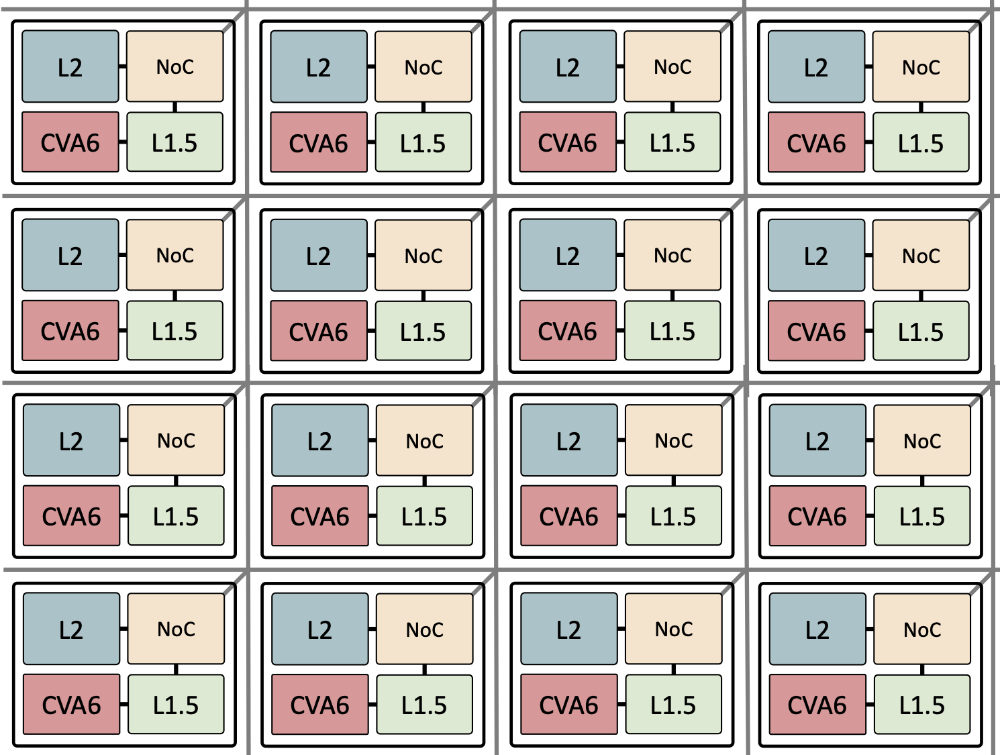
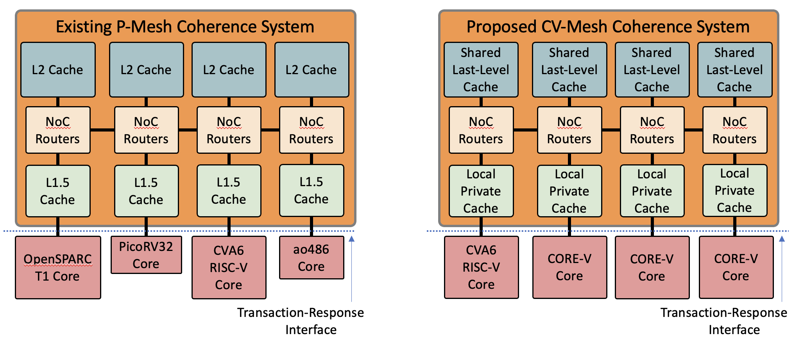

# Title of Project - "CORE-V CV-Mesh"
# Project Concept Proposal
## Date of proposal - 2023-07-24
## Author(s) - Jonathan Balkind, Assistant Professor, UC Santa Barbara

## High Level Summary of project, project components, and deliverables

OpenPiton is a manycore processor design and research framework, in development since late 2013 and open-source since mid 2015. Its coherence system, known as P-Mesh, enables creation of large meshes of cores and other heterogeneous elements. A number of designs have been taped out including Piton (25 tiles/cores, using the OpenSPARC T1 core), CIFER (8 tiles: 22 cores, including 4 CVA6 cores, plus an eFPGA), and DECADES (108 tiles: 60 CVA6 cores, 24 accelerators, 23 intelligent storage tiles, plus an eFPGA).

The goal of this project is to bring the P-Mesh coherence system into the OpenHW ecosystem to enable users to build large meshes of OpenHW CORE-V and other cores and accelerators. We propose to name this CV-Mesh and to separate it from OpenPiton itself as an independent IP block.

### Features of P-Mesh (to be adopted as CV-Mesh)

* Directory-based coherence model
* Three-level cachee hierarchy
* MESI protocol
* Support for heterogeneous cores via Transaction-Response Interface
* Support for coherent LLC access from other heterogeneous elements
* Can connect arbitrary point-to-point ordered NoCs
* Open source (BSD license)
* SystemVerilog

### Components

* Component 1: CV-Mesh protocol specification
* Component 2: CV-Mesh user guide
* Component 3: RTL implementation of the local private cache (L1.5 cache from OpenPiton P-Mesh) verified to TRL 5
* Component 4: RTL implementation of the shared last-level cache (L2 cache from OpenPiton P-Mesh) verified to TRL 5
* Component 5: RTL implementation of bridges for P-Mesh to/from AXI and AXI-Lite verified to TRL 3
* Component 6: RTL implementation of physical 2D-mesh network-on-chip (dynamic node network from OpenPiton P-Mesh) verified to TRL 3

## Summary of market or input requirements
### Known market/project requirements at PC gate

* OpenPiton designs have been taped out by a number of teams, including the following chips:
    * Piton (25 tiles/cores, using the OpenSPARC T1 core) in 32nm technology
    * CIFER (8 tiles: 22 cores, including 4 CVA6 cores, plus an eFPGA) in 12nm technology
    * DECADES (108 tiles: 60 CVA6 cores, 24 accelerators, 23 intelligent storage tiles, plus an eFPGA) in 12nm technology
    * Intel (8 tiles/cores, using the CVA6 core) in Intel 4 technology

### Potential future enhancements

## Who would make use of OpenHW output

Those interested in building scalable clusters of OpenHW CORE-V and other cores.

## Initial Estimate of Timeline

* Separating coherence IP from OpenPiton repository (Q4 2023)
* Connection to CV-HPDC (initial support and validation complete in Q1 2024)
* Enhancing performance characteristics and parameterisation (Q2 2024)
* Standalone verification environment (Q4 2024)
* Improvement of documentation (Q4 2024)
* User guide (Q4 2024)

## Explanation of why OpenHW should do this project

The P-Mesh coherence system as established in OpenPiton has been in development since late 2013 and open-source since mid 2015. The system already supports the CVA6 core and has seen significant adoption. The IP has been well validated for use with a number of cores and ISAs, as well as heterogeneous capabilities for integrating accelerators, FPGAs, and more, including large chips with 100s of tiles and billions of transistors. The project will extend OpenHW's move into HPC and combined with CV-HPDC will enable connection of higher performance cores in the near future.

## Industry landscape: description of competing, alternative, or related efforts in the industry

### BedRock

The BedRock coherence protocol was established for creation of coherent clusters of BlackParrot cores.

* Directory-based coherence model
* Two-level cachee hierarchy
* Capable of coherence protocols like MOESIF (and many subsets)
* Uses a microcoded coherence engine
* Open source (BSD license)
* SystemVerilog

### ESP

ESP has a long history and focuses on accelerator-rich SoCs. Originally designed for LEON3 but today supports CVA6 and Ibex as host cores.

* Directory-based coherence model
* Three-level cache hierarchy
* MESI protocol or Spandex heterogeneous coherence
* 32 bit physical addresses
* Open source (Apache license)
* SystemC & SystemVerilog

### TileLink 2

TileLink is the primary coherence protocol used among users of Rocket/BOOM, and was specified by SiFive. There are a number of configurable implementations so we elide the details here.

* Supports both snooping and directory-based coherence models
* Open source (varies - BSD license for some IP)
* Chisel (primarily)

### AMBA ACE/CHI/etc

Arm's AMBA protocols include ACE and CHI which enable coherent operation.

* Primarily snoop-based coherence model
* Commercial protocols with some open source implementations
* OpenHW ACE implementation in SystemVerilog: "CORE-V tightly-coupled cache coherence mechanism for CVA6"

## OpenHW Members/Participants committed to participate

Jonathan Balkind, Assistant Professor, UC Santa Barbara
Miquel Moretó, Associate Researcher, Barcelona Supercomputing Center & Associate Professor, Universitat Politècnica de Catalunya (UPC)
Lluc Alvarez, Established Researcher, Barcelona Supercomputing Center
César Fuguet, CEA List, Grenoble

## Project Leader(s)
### Technical Project Leader(s)

Jonathan Balkind, Assistant Professor, UC Santa Barbara

### Project Manager, if a PM is designated

N/A

# Title of Project - "CORE-V CV-Mesh"
# Project Launch Proposal
## Date of proposal - 2023-07-24
## Author(s) - Jonathan Balkind, Assistant Professor, UC Santa Barbara

## Summary of project

OpenPiton is a manycore processor design and research framework, in development since late 2013 and open-source since mid 2015. Its coherence system, known as P-Mesh, enables creation of large meshes of cores and other heterogeneous elements. A number of designs have been taped out including Piton (25 tiles/cores, using the OpenSPARC T1 core), CIFER (8 tiles: 22 cores, including 4 CVA6 cores, plus an eFPGA), and DECADES (108 tiles: 60 CVA6 cores, 24 accelerators, 23 intelligent storage tiles, plus an eFPGA).

The goal of this project is to bring the P-Mesh coherence system into the OpenHW ecosystem to enable users to build large meshes of OpenHW CORE-V and other cores and accelerators. We propose to name this CV-Mesh and to separate it from OpenPiton itself as an independent IP block.

### Components of the Project

* Component 1: CV-Mesh protocol specification
* Component 2: CV-Mesh user guide
* Component 3: RTL implementation of the local private cache (L1.5 cache from OpenPiton P-Mesh) verified to TRL 5
* Component 4: RTL implementation of the shared last-level cache (L2 cache from OpenPiton P-Mesh) verified to TRL 5
* Component 5: RTL implementation of bridges for P-Mesh to/from AXI and AXI-Lite verified to TRL 3
* Component 6: RTL implementation of physical 2D-mesh network-on-chip (dynamic node network from OpenPiton P-Mesh) verified to TRL 3

#### Component 1 Description

OpenPiton provides a microarchitecture specification document which describes the P-Mesh coherence protocol. This document has fallen out of date versus a number of more recent changes and the sources are in latex. This component will be brought up to date and into a better open format.

#### Component 2 Description

The CV-Mesh user guide will describe the interfaces provided by the CV-Mesh caches, network, and bridges. It will provide users with the information needed to correctly instantiate these components to build their own system-on-chip, to complement the example design(s) provided in the Polara APU repository. It will also describe what types of requests and responses can be sent to/from the different caches and which protocols (or subsets thereof) are supported by the protocol bridges.

#### Component 3 Description

The local private cache (L1.5 cache in P-Mesh) generally acts as a second layer of cache. It communicates with the shared last-level cache to maintain cache coherence for cores and other agents. To decouple the core from the coherence protocol itself, the cache offers the Transaction-Response Interface (TRI) which is implemented by any core connected into the system. This includes the write-through L1 cache used in CVA6. Support for TRI in CV-HPDC will be developed as part of the project, as will a number of performance enhancements.

#### Component 4 Description

The shared last-level cache (L2 cache in P-Mesh) acts as the coherence directory and supports coherent and non-coherent access over the network-on-chip. Privates caches interact with the L2 to maintain the coherence protocol, but other agents may also communicate directly with the last-level cache to perform coherent reads or writes without participating in the entire coherence protocol.

#### Component 5 Description

As not every peripheral implements the P-Mesh coherence protocol, it provides bridges between P-Mesh and other protocols, most relevantly AXI and AXI-Lite. These enable interaction with a variety of peripherals, accelerators, DMAs, etc.

#### Component 6 Description

OpenPiton uses three physical networks-on-chip to maintain deadlock-free communication between the caches and main memory. The platform supports replacement of the network routers with others provided they maintain point-to-point ordering for messages. As a result, in CV-Mesh, the network routers from P-Mesh are only provided as an example with the recognition that users may replace them with other network routers.

## Summary of market or input requirements
### Known market/project requirements at PL gate

* OpenPiton designs have been taped out by a number of teams, including the following chips:
    * Piton (25 tiles/cores, using the OpenSPARC T1 core) in 32nm technology
    * CIFER (8 tiles: 22 cores, including 4 CVA6 cores, plus an eFPGA) in 12nm technology
    * DECADES (108 tiles: 60 CVA6 cores, 24 accelerators, 23 intelligent storage tiles, plus an eFPGA) in 12nm technology
    * Intel (8 tiles/cores, using the CVA6 core) in Intel 4 technology

### Potential future enhancements for future project phases

## Who would make use of OpenHW output

Those interested in building scalable clusters of OpenHW CORE-V and other cores.

## Summary of Timeline

* Separating coherence IP from OpenPiton repository (Q4 2023)
* Connection to CV-HPDC (initial support and validation complete in Q1 2024)
* Enhancing performance characteristics and parameterisation (Q2 2024)
* Standalone verification environment (Q4 2024)
* Improvement of documentation (Q4 2024)
* User guide (Q4 2024)

## Explanation of why OpenHW should do this project

The P-Mesh coherence system as established in OpenPiton has been in development since late 2013 and open-source since mid 2015. The system already supports the CVA6 core and has seen significant adoption. The IP has been well validated for use with a number of cores and ISAs, as well as heterogeneous capabilities for integrating accelerators, FPGAs, and more, including large chips with 100s of tiles and billions of transistors. The project will extend OpenHW's move into HPC and combined with CV-HPDC will enable connection of higher performance cores in the near future.

## Industry landscape: description of competing, alternative, or related efforts in the industry

### BedRock

The BedRock coherence protocol was established for creation of coherent clusters of BlackParrot cores.

* Directory-based coherence model
* Two-level cachee hierarchy
* Capable of coherence protocols like MOESIF (and many subsets)
* Uses a microcoded coherence engine
* Open source (BSD license)
* SystemVerilog

### ESP

ESP has a long history and focuses on accelerator-rich SoCs. Originally designed for LEON3 but today supports CVA6 and Ibex as host cores.

* Directory-based coherence model
* Three-level cache hierarchy
* MESI protocol or Spandex heterogeneous coherence
* 32 bit physical addresses
* Open source (Apache license)
* SystemC & SystemVerilog

### TileLink 2

TileLink is the primary coherence protocol used among users of Rocket/BOOM, and was specified by SiFive. There are a number of configurable implementations so we elide the details here.

* Supports both snooping and directory-based coherence models
* Open source (varies - BSD license for some IP)
* Chisel (primarily)

### AMBA ACE/CHI/etc

Arm's AMBA protocols include ACE and CHI which enable coherent operation.

* Primarily snoop-based coherence model
* Commercial protocols with some open source implementations
* OpenHW ACE implementation in SystemVerilog: "CORE-V tightly-coupled cache coherence mechanism for CVA6"

## OpenHW Members/Participants committed to participate

Jonathan Balkind, Assistant Professor, UC Santa Barbara
Miquel Moretó, Associate Researcher, Barcelona Supercomputing Center & Associate Professor, Universitat Politècnica de Catalunya (UPC)
Lluc Alvarez, Established Researcher, Barcelona Supercomputing Center
César Fuguet, CEA List, Grenoble

## Project Leader(s)
### Technical Project Leader(s)

Jonathan Balkind, Assistant Professor, UC Santa Barbara

### Project Manager, if a PM is designated

N/A

## Project Documents
### Project Planning Documents

* PL document (this document)

### Project Output Documents

* CV-Mesh protocol specification 
* CV-Mesh user guide

## List of project technical outputs

* Enhanced versions of the five components which are already provided as inputs for the project

### Feature Requirements

#### Feature 1

* Connection to CV-HPDC

#### Feature 2

* Support for wider networks-on-chip

#### Feature 3

* Support for larger cache block sizes in the local private cache

#### Feature 4

* Improved parameterisation of caches

## External dependencies

* OpenPiton

## OpenHW TGs Involved

* TWG: Interconnect

## Resource Requirements

### Engineering resource supplied by members - requirement and availability

Team from UC Santa Barbara
Team from Barcelona Supercomputing Center

### OpenHW engineering staff resource plan: requirement and availability

N/A

### Marketing resource  - requirement and availability

N/A

### Funding for project aspects - requirement and availability 

N/A

## Architecture and/or context diagrams 

The following figure shows a top-level view of a 16-core CVA6 system previously demonstrated with P-Mesh.

The following figure shows a system enabled by P-Mesh compared with a future system enabled by CV-Mesh. The CV-Mesh IP is made of the components shown within the orange box.

## Project license model

* 3-Clause BSD (following existing OpenPiton P-Mesh)

## Description of initial code contribution, if required

P-Mesh code is already hosted by OpenHW as part of the Polara APU GitHub repository. The P-Mesh component will be brought into its own repository as CV-Mesh.

## Repository Requirements

* Repository for CV-Mesh IP
* Submodule linkage to branch(es) on Polara APU repository (which is an OpenPiton fork)

## Project distribution model

OpenHW GitHub repositories

## Preliminary Project plan
*A full project plan is not required at PL. A preliminary plan, which can be for instance the schedule for completion of component or feature list, together with responsible resource, should be provided. Full details should be provided at PA gate.*

## Risk Register
*A list of known risks, for example external dependencies, and any mitigation strategy*

