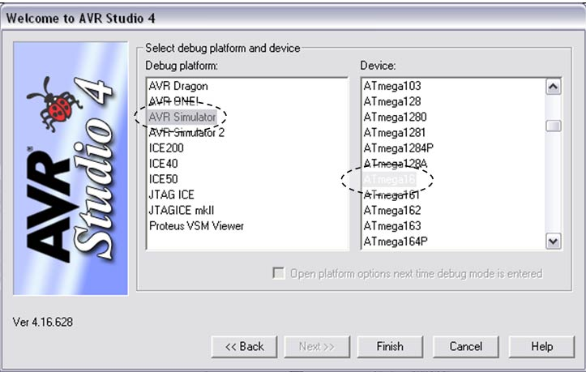

# OpenHW project concept proposal: Verilator models for software developers

## Summary of project
This project aims to provide a stable and reasonably reliable Verilator system model for CORE-V cores.  The purpose is to support software development flows for which cycle accurate modeling of the target is appropriate, such as OS bring up and tool chain testing and optimization.  The proposal is to base this on X-HEEP.

This proposal replaces the "MCU Verilator Model project", and will reuse much of the work from that project.

The concept is inspired by AVR Studio:

Key features of AVR Studio:

- Contained a Verilator model of every AVR core
  - over 200 different processors
  - added a debug interface and memory
- Allowed the user to develop and benchmark code pre-silicon
  - GCC for compilation
  - GDB integrated into Eclipse for debug
  - Cycle accurate for benchmarking

From the [Verilator Wikipedia entry](https://www.veripool.org/wiki/verilator):

> Verilator is a free and open-source software tool capable of converting Synthesizable Verilog/SystemVerilog to a cycle-accurate cycle-accurate, 2-state behavioral model in C++ or SystemC.

From the [X-HEEP README](https://github.com/esl-epfl/x-heep/blob/main/README.md):

> X-HEEP (eXtendable Heterogeneous Energy-Efficient Platform) is a RISC-V microcontroller described in SystemVerilog that can be configured to target small and tiny platforms as well as extended to support accelerators.

Separate plan approval and project launch reviews will be required for each core to be supported.

##  Components
The project has two parts:

### Component 1: Software debug target
Creation of a component usable as either a standalone debug program or library implementing the remote serial protocol for connection by GDB or LLDB. The library version would be suitable for integration within an IDE.

### Component 2 (optional): Standalone system model
Creation of a standalone executable taking a software program as argument, running to completion, and returning the return code of the program (i.e. the same behaviour as a standalone GNU simulator).

## Why OpenHW Group should do this project
The main reason is that software tool chain and operating system developers working with Core-V reference MCU (both SoC and FPGA) need a system model. This allows people to begin development without having physical hardware, expanding the potential reach of s/w dev on the MCU platform.

OpenHW is best placed to do this project due to our obvious knowledge of the cores and the requirements.

### Summary of development

1. (Component 1) creating flow to generate model from X-HEEP
2. (Component 1) implementing a debug server for GDB/LLDB
3. (Component 1) software models of UART, LED
4. (Component 2) creating standalone executable for software use

Note there is reuse of the debug server from the earlier MCU Verilator Model project.

### Summary of timeline

This will be provided at plan approval review.

## OpenHW members/participants committed to participate

Embecosm - debug server

## Technical project leader(s) (TPLs)
Combined with PM role
- Jeremy Bennett (Embecosm)

## Project manager (PM)
- separate PM not required

## Project documents
The following project documents will be created:

User Manual in 2 components

1. Debug server
2. Standalone software model

## Summary of requirements

### Software

The model will be used in development of the following software components:

1. GCC
2. LLVM
3. FreeRTOS

###  Debug

Component 2 will use the Embecosm Debug Server.  **Note.** It is not the planned to use OpenOCD.

### Peripherals

1. LED
2. UART

## Industry landscape

_This is a description of competing, alternative, or related efforts in the industry._

Fast models which are not cycle accurate

- QEMU
- OVPSIM

## External dependencies
External open source technology:

- Verilator (GPL or Perl Artistic License)
- X-HEEP (Apache 2.0)
- Embdebug (GPL license v3 with exception)

## List of project outputs

- For each core, a verilator models for use as a standalone debug server or integrated into the CORE-V SDK
- For those cores which support it, a standalone simulator for programs supplied via the command line.

## TGs impacted/resource requirements

This project is under the auspices of the SW TG.

## OpenHW engineering staff resource plan: requirement and availability

This will be provided at plan approval review.

## Engineering resource supplied by members - requirement and availability

This will be provided at plan approval review.

## OpenHW marketing resource - requirement and availability

This will be provided at plan approval review.

## Marketing resource supplied by members - requirement and availability

This will be provided at plan approval review.

## Funding supplied by OpenHW - requirement and availability

This will be provided at plan approval review.

## Funding supplied by members - requirement and availability

This will be provided at plan approval review.

## Architecture diagram

This will be provided at plan approval review.

## Who would make use of OpenHW output

Any software developer developing low-level software for CORE-V cores

## Project license model

- Debug server (Embdebug) is GPL3 with exception
- X-HEEP is Apache 2.0
- Verilog generated model - Solderpad

## Description of initial code contribution, if required

Debug server written for the MCU Verilator Model project and used to verify GCC for CV32E40Pv2 contributed by Embecosm.

## Repository structure

Need a separate repo for the Verilator model(s)

Embdebug target will need a separate repo

## Project distribution model

* OpenHW GitHub Repository

## Preliminary project plan

This will be provided at plan approval review.

## Preliminary risk register

Risk is scored as likelihood (1-10) x impact (1-3) with mitigation required for any risk with score of 10 or more, of with an impact of 3 (project killer).

| Risk                                            | L | I |  R | Mitigation                                                    |
|:------------------------------------------------|--:|--:|---:|:--------------------------------------------------------------|
| Bugs in X-HEEP                                  | 9 | 2 | 18 | Work with EPFL to eliminate the bugs                          |
| X-HEEP can't be maintained, since academic code | 8 | 2 | 16 | May need to fork to have a stable version                     |
| Insufficient resource                           | 9 | 3 | 27 | Socialize around OpenHW members to find expertise or funding. |
