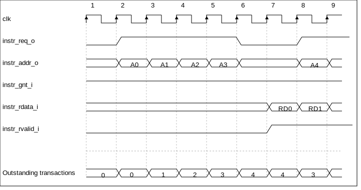

Instruction Fetch
=================

The instruction fetcher of the CV32E40P is able to supply one instruction to
the ID stage per cycle if the external bus interface is able to serve one
instruction per cycle. In case of executing compressed instructions, on average
less than one 32-bit instruction fetch will we needed per instruction in the
ID stage. The (internal) instruction address is half-word-aligned due to the
support of compressed instructions. It is not possible to jump to instruction
addresses that have the LSB bit set.

For optimal performance and timing closure reasons, a prefetcher is used
which fetches instructions via the external bus interface from for example
an externally connected instruction memory or instruction cache.

The prefetch unit performs word-aligned 32-bit prefetches and stores the
fetched words in a FIFO with four entries. As a result of this (speculative)
prefetch, CV32E40P can fetch up to four words outside of the code region
and care should therefore be taken that no unwanted read side effects occur
for such prefetches that are outside of the actual code region.

Table 1 describes the signals that are used to fetch instructions. This
interface is a simplified version of the interface that is used by the
LSU, which is described in Chapter 3. The difference is that no writes
are possible and thus it needs fewer signals.

+-------------------------+-----------------+--------------------------------------------------------------------------------------------------------------------------------+
| **Signal**              | **Direction**   | **Description**                                                                                                                |
+-------------------------+-----------------+--------------------------------------------------------------------------------------------------------------------------------+
| instr\_req\_o           | output          | Request ready, will stay high until instr\_gnt\_i is high for one cycle                                                        |
+-------------------------+-----------------+--------------------------------------------------------------------------------------------------------------------------------+
| instr\_addr\_o[31:0]    | output          | Address                                                                                                                        |
+-------------------------+-----------------+--------------------------------------------------------------------------------------------------------------------------------+
| instr\_rdata\_i[31:0]   | input           | Data read from memory                                                                                                          |
+-------------------------+-----------------+--------------------------------------------------------------------------------------------------------------------------------+
| instr\_rvalid\_i        | input           | instr\_rdata\_i holds valid data when instr\_rvalid\_i is high. This signal will be high for exactly one cycle per request.    |
+-------------------------+-----------------+--------------------------------------------------------------------------------------------------------------------------------+
| instr\_gnt\_i           | input           | The other side accepted the request. instr\_addr\_o may change in the next cycle.                                              |
+-------------------------+-----------------+--------------------------------------------------------------------------------------------------------------------------------+

Table 1: Instruction Fetch Signals

Protocol
--------

The instruction bus interface is compliant to the OBI (Open Bus Interface) protocol.
See https://github.com/openhwgroup/core-v-docs/blob/master/cores/cv32e40p/OBI-v1.0.pdf
for details about the protocol. The CV32E40P instruction fetch interface does not
implement the following optional OBI signals: we, be, wdata, auser, wuser, aid,
rready, err, ruser, rid. These signals can be thought of as being tied off as
specified in the OBI specification. The CV32E40P instruction fetch interface can
cause up to four outstanding transactions.

Figure 2 and Figure 3 show example timing diagrams of the protocol.

.. figure:: ../images/obi_instruction_basic.svg
   :name: obi instruction basic
   :align: center
   :alt:

   Figure 2: Back-to-back Memory Transactions

   Figure 3: Multiple Outstanding Memory Transactions
