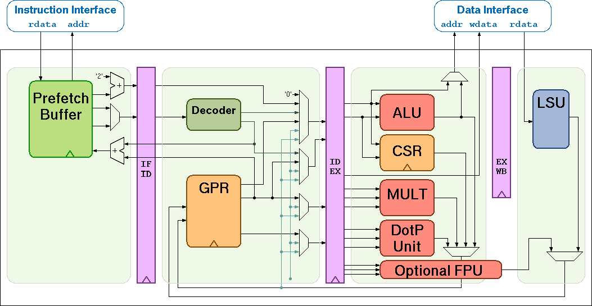

Introduction 
=============

CV32E40P (previously known as RI5CY) is a 4-stage in-order 32b RISC-V
processor core. The ISA of CV32E40P
has been extended to support multiple additional instructions including
hardware loops, post-increment load and store instructions and
additional ALU instructions that are not part of the standard RISC-V
ISA.

Figure 1 shows a block diagram of the core.

   Figuire 1: Block Diagram of CV32E40P RISC-V Core

License
-------
Copyright 2020 OpenHW Group.

Copyright 2018 ETH Zurich and University of Bologna.

Copyright and related rights are licensed under the Solderpad Hardware
License, Version 0.51 (the “License”); you may not use this file except
in compliance with the License. You may obtain a copy of the License at
http://solderpad.org/licenses/SHL-0.51. Unless required by applicable
law or agreed to in writing, software, hardware and materials
distributed under this License is distributed on an “AS IS” BASIS,
WITHOUT WARRANTIES OR CONDITIONS OF ANY KIND, either express or implied.
See the License for the specific language governing permissions and
limitations under the License.

Supported Instruction Set
-------------------------

CV32E40P supports the following instructions:

-  Full support for RV32I Base Integer Instruction Set

-  Full support for RV32C Standard Extension for Compressed Instructions

-  Full support for RV32M Integer Multiplication and Division
   Instruction Set Extension

-  Full support for Zifencei (Instruction-Fetch Fence)

-  Full support for Zicsr (Control and Status Register (CSR) Instructions)

-  Full support for the Counters extension

-  Optional full support for RV32F Single Precision Floating Point
   Extensions

.. only:: ATOMIC

-  Optional full support for RV32A Standard Extension for Atomic
   Instructions, v2.0

-  PULP specific extensions

   -  Post-Incrementing load and stores, see Chapter 3

   -  Multiply-Accumulate extensions, see Chapter 4

   -  ALU extensions, see Chapter 5

   -  Optional support for Hardware Loops, see Chapter 7

Optional Floating Point Support
-------------------------------

Floating-point support in the form of IEEE-754 single precision can be
enabled by setting the parameter **FPU** of the toplevel file
"riscv\_core" to one. This will instantiate the FPU in the execution
stage and extend the ALU to support the floating-point comparisons and
classifications. By default a dedicated register file consisting of 32
floating-point registers, f0-f31, is instantiated. This default behavior
can be overruled by setting the parameter **PULP_ZFINX** of the toplevel
file "riscv\_core" to one, in which case the dedicated register file is
not included and the general purpose register file is used instead to
host the floating-point operands.

ASIC Synthesis
--------------

ASIC synthesis is supported for CV32E40P. The whole design is completely
synchronous and uses positive-edge triggered flip-flops, except for the
register file, which can be implemented either with latches or with
flip-flops. See Chapter 8 for more details about the register file. The
core occupies an area of about 50 kGE when the latch based register file
is used. With the FPU, the core area increases to about 90 kGE (30kGE
FPU, 10kGE additional register file).

FPGA Synthesis
--------------

FPGA synthesis is supported for CV32E40P when the flip-flop based register
file is used. Since latches are not well supported on FPGAs, it is
crucial to select the flip-flop based register file.

Outline
-------

This document summarizes all the functionality of the CV32E40P core in more
detail. First, the instruction and data interfaces are explained in
Chapter 2 and 3. The multiplier as well as the ALU are then explained in
Chapter 4 and 5. Chapter 7 focuses on the hardware loop extensions and
Chapter 9 explains the register file. Control and status registers are
explained in Chapter 10 and Chapter 11 gives an overview of all
performance counters. Chapter 12 deals with exceptions and interrupts,
and Chapter 13 summarizes the accessible debug registers. Finally,
Chapter 14 gives an overview of all instruction-extensions, its
encodings and meanings.

Contributors
============
| Andreas Traber
  (`*atraber@iis.ee.ethz.ch* <mailto:atraber@iis.ee.ethz.ch>`__)

Michael Gautschi
(`*gautschi@iis.ee.ethz.ch* <mailto:gautschi@iis.ee.ethz.ch>`__)

Pasquale Davide Schiavone
(`*pschiavo@iis.ee.ethz.ch* <mailto:pschiavo@iis.ee.ethz.ch>`__)

Arjan Bink (`*arjan.bink@silabs.com* <mailto:arjan.bink@silabs.com>`__)

| Micrel Lab and Multitherman Lab
| University of Bologna, Italy

| Integrated Systems Lab
| ETH Zürich, Switzerland

Document Revisions
------------------

| May 2020
| Revision 4.5

+--------+------------+--------------------+--------------------------------------------------------------------------------------------------+
| Rev.   | Date       | Author             | Description                                                                                      |
+========+============+====================+==================================================================================================+
| 0.1    | 25.02.16   | Andreas Traber     | First Draft                                                                                      |
+--------+------------+--------------------+--------------------------------------------------------------------------------------------------+
| 0.8    | 13.05.16   | Andreas Traber     | Added instruction encoding                                                                       |
+--------+------------+--------------------+--------------------------------------------------------------------------------------------------+
| 0.9    | 19.05.16   | Michael Gautschi   | Typos and general corrections                                                                    |
+--------+------------+--------------------+--------------------------------------------------------------------------------------------------+
| 1.1    | 12.07.16   | P.D. Schiavone     | Removed pv.ball, and replaced with p.beqimm                                                      |
+--------+------------+--------------------+--------------------------------------------------------------------------------------------------+
| 1.2    | 14.11.16   | P.D. Schiavone     | Added register variants of clip, addnorm, and bit manipulation instructions                      |
+--------+------------+--------------------+--------------------------------------------------------------------------------------------------+
| 1.3    | 04.01.17   | Michael Gautschi   | Fixed typos, references, foot notes and date style                                               |
+--------+------------+--------------------+--------------------------------------------------------------------------------------------------+
| 1.4    | 08.03.17   | P.D. Schiavone     | Updated to priv spec 1.9 and new IRQ handling                                                    |
+--------+------------+--------------------+--------------------------------------------------------------------------------------------------+
| 1.5    | 06.06.17   | P.D. Schiavone     | General updates                                                                                  |
+--------+------------+--------------------+--------------------------------------------------------------------------------------------------+
| 1.6    | 03.07.17   | Michael Gautschi   | Extended with optional FP support                                                                |
+--------+------------+--------------------+--------------------------------------------------------------------------------------------------+
| 1.7    | 12.07.17   | P.D. Schiavone     | Revised instructions added in Rev. 1.2                                                           |
+--------+------------+--------------------+--------------------------------------------------------------------------------------------------+
| 1.8    | 08.11.17   | P.D. Schiavone     | Add note in HW Loop                                                                              |
+--------+------------+--------------------+--------------------------------------------------------------------------------------------------+
| 1.9    | 06.02.18   | A. Ruospo          | Fixed CSR reset values and general corrections                                                   |
+--------+------------+--------------------+--------------------------------------------------------------------------------------------------+
| 2.0    | 08.03.18   | P.D. Schiavone     | Fixed Documentation issue with lp.setupi instruction #29                                         |
+--------+------------+--------------------+--------------------------------------------------------------------------------------------------+
| 2.1    | 16.05.18   | P.D. Schiavone     | Fixed Documentation issue in Debug                                                               |
+--------+------------+--------------------+--------------------------------------------------------------------------------------------------+
| 2.2    | 28.06.18   | P.D. Schiavone     | Fixed Nested Exception Support #40                                                               |
+--------+------------+--------------------+--------------------------------------------------------------------------------------------------+
| 3.0    | 19.12.18   | P.D. Schiavone     | PMP plus priv spec 1.10                                                                          |
+--------+------------+--------------------+--------------------------------------------------------------------------------------------------+
| 4.0    | 17.04.19   | P.D. Schiavone     | New debug. Change HWLoop addresses                                                               |
+--------+------------+--------------------+--------------------------------------------------------------------------------------------------+
| 4.1    | 21.08.19   | Robert Balas       | Update PCER and PCMR addresses                                                                   |
+--------+------------+--------------------+--------------------------------------------------------------------------------------------------+
| 4.2    | 20.12.19   | P.D. Schiavone     | Issue #98, #103, #110, #111                                                                      |
+--------+------------+--------------------+--------------------------------------------------------------------------------------------------+
| 4.3    | 28.01.20   | P.D. Schiavone     | New HWLoop constraints and issue #209                                                            |
+--------+------------+--------------------+--------------------------------------------------------------------------------------------------+
| 4.4    | 30.03.20   | A. Bink            | Fixed MIEX, MTVECX, MIPX CSR addresses and added description for MIPX, MTVECX, MIEX, MIP, MIE.   |
+--------+------------+--------------------+--------------------------------------------------------------------------------------------------+
| 4.5    | 06.05.20   | A. Bink            | Fixed supported instruction set section.                                                         |
+--------+------------+--------------------+--------------------------------------------------------------------------------------------------+

