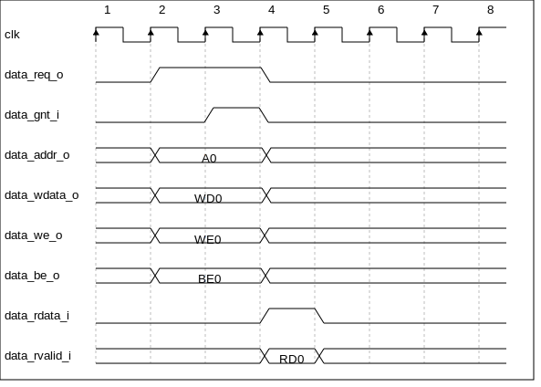
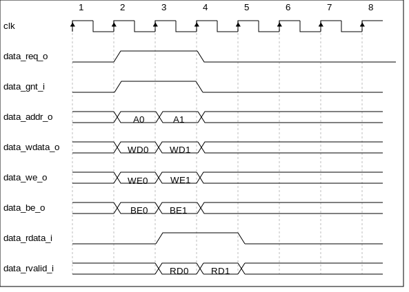
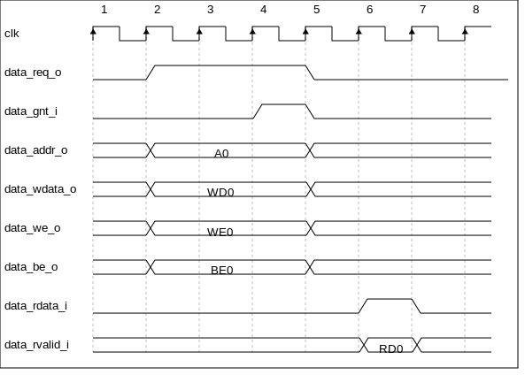

Load-Store-Unit (LSU)
=====================

The Load-Store Unit (LSU) of the core takes care of accessing the data memory. Load and
stores on words (32 bit), half words (16 bit) and bytes (8 bit) are
supported.

Table 2 describes the signals that are used by the LSU.

+------------------------+-----------------+------------------------------------------------------------------------------------------------------------------------------+
| **Signal**             | **Direction**   | **Description**                                                                                                              |
+------------------------+-----------------+------------------------------------------------------------------------------------------------------------------------------+
| data\_req\_o           | output          | Request valid, will stay high until data\_gnt\_i is high for one cycle                                                       |
+------------------------+-----------------+------------------------------------------------------------------------------------------------------------------------------+
| data\_addr\_o[31:0]    | output          | Address                                                                                                                      |
+------------------------+-----------------+------------------------------------------------------------------------------------------------------------------------------+
| data\_we\_o            | output          | Write Enable, high for writes, low for reads. Sent together with data\_req\_o                                                |
+------------------------+-----------------+------------------------------------------------------------------------------------------------------------------------------+
| data\_be\_o[3:0]       | output          | Byte Enable. Is set for the bytes to write/read, sent together with data\_req\_o                                             |
+------------------------+-----------------+------------------------------------------------------------------------------------------------------------------------------+
| data\_wdata\_o[31:0]   | output          | Data to be written to memory, sent together with data\_req\_o                                                                |
+------------------------+-----------------+------------------------------------------------------------------------------------------------------------------------------+
| data\_rdata\_i[31:0]   | input           | Data read from memory                                                                                                        |
+------------------------+-----------------+------------------------------------------------------------------------------------------------------------------------------+
| data\_rvalid\_i        | input           | data\_rdata\_i holds valid data when data\_rvalid\_i is high. This signal will be high for exactly one cycle per request.    |
+------------------------+-----------------+------------------------------------------------------------------------------------------------------------------------------+
| data\_gnt\_i           | input           | The other side accepted the request. data\_addr\_o may change in the next cycle                                              |
+------------------------+-----------------+------------------------------------------------------------------------------------------------------------------------------+

Table 2: LSU Signals

Misaligned Accesses
-------------------

The LSU is able to handle misaligned accesses, meaning accesses that
are not aligned on natural word boundaries. However, it does so by performing
two separate word-aligned accesses. This means that at least
two cycles are needed for misaligned loads and stores.

Protocol
--------

The data bus interface is compliant to the OBI (Open Bus Interface) protocol.
See https://github.com/openhwgroup/core-v-docs/blob/master/cores/cv32e40p/OBI-v1.0.pdf
for details about the protocol. The CV32E40P data interface does not implement
the following optional OBI signals: auser, wuser, aid, rready, err, ruser, rid.
These signals can be thought of as being tied off as specified in the OBI
specification. The CV32E40P data interface can cause up to two outstanding
transactions.

The OBI protocol that is used by the LSU to communicate with a memory works
as follows.

The LSU provides a valid address on data\_addr\_o, control information
on data\_we\_o, data\_be\_o (as well as write data on data\_wdata\_o in
case of a store) and sets data\_req\_o high. The memory sets data\_gnt\_i
high as soon as it is ready to serve the request. This may happen at any
time, even before the request was sent. After a request has been granted
the address phase signals (data\_addr\_o, data\_we\_o, data\_be\_o and
data\_wdata\_o) may be changed in the next cycle by the LSU as the memory
is assumed to already have processed and stored that information. After
granting a request, the memory answers with a data\_rvalid\_i set high
if data\_rdata\_i is valid. This may happen one or more cycles after the
request has been granted. Note that data\_rvalid\_i must also be set when
a write was performed, although the data\_rdata\_i has no meaning in this
case. When multiple granted requests are outstanding, it is assumed that
the memory requests will be kept in-order and one data\_rvalid\_i will be
signalled for each of them, in the order they were issued.

Figure 4, Figure 5, Figure 6 and Figure 7 show example timing diagrams of
the protocol.

   Figure 4: Basic Memory Transaction

   Figure 5: Back-to-back Memory Transactions

   Figure 6: Slow Response Memory Transaction

   Figure 7: Multiple Outstanding Memory Transactions

Physical Memory Protection (PMP) Unit
-------------------------------------

The CV32E40P core has a PMP module which can be enabled by setting the
parameter PULP_SECURE=1 which also enabled the core to possibly run in
USER MODE. Such unit has a configurable number of entries (up to 16) and
supports all the modes as TOR, NAPOT and NA4. Every fetch, load and
store access executed in USER MODE are first filtered by the PMP unit
which can possibly generated exceptions. For the moment, the MPRV bit in
MSTATUS as well as the LOCK mechanism in the PMP are not supported.

Post-Incrementing Load and Store Instructions
---------------------------------------------

Post-incrementing load and store instructions perform a load/store
operation from/to the data memory while at the same time increasing the
base address by the specified offset. For the memory access, the base
address without offset is used.

Post-incrementing load and stores reduce the number of required
instructions to execute code with regular data access patterns, which
can typically be found in loops. These post-incrementing load/store
instructions allow the address increment to be embedded in the memory
access instructions and get rid of separate instructions to handle
pointers. Coupled with hardware loop extension, these instructions allow
to reduce the loop overhead significantly.
