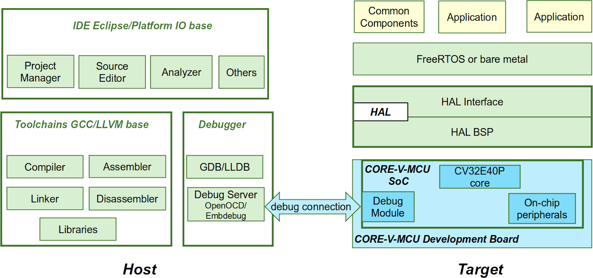

# OpenHW Project Concept Proposal: CORE-V Software Development Kit (SDK)

## Summary of project

This project aims to create and maintain a production quality SDK as part of the CORE-V Development Kit.

The key objectives are:

- the SDK must be a positive "out-of-the-box" experience for end users;
- The SDK must include example programs that can run immediately and then be modified to act as starting points for user code;
- the SDK must support both bare metal and FreeRTOS based development; and
- the SDK must support use of Symbiflow hardware design tools to support the on-board programmable FPGA.

The SDK is a sub-project of the overall Development Kit project, which will be responsible for delivery of the complete product, including the SoC, the physical development board, its manufacture, marketing and distribution.

This Concept Proposal addresses version 1 of the SDK only. It will not include the Hardware Abstraction Layer (HAL), nor the CORE-V GNU compiler tool chain, since neither of these will be complete in time. There is no proposal to support the Clang/LLVM compiler tool chain.

##  Components

All the components which make up the SDK are shown in light green in the following image:

Note that some of the software potentially ends up on the board: libraries, HAL (not in version 1), FreeRTOS kernel and drivers.

See the [Summary of requirements](#summary-of-requirements) for the requirements driving each of these components.

### Component 1 - OpenHW IDE and debugger

This is based on Eclipse CDT

**Current status:** Initial development by Alexander Fedorov operational, with minimal examples and using the upstream compiler tool chain. Debugger integration for the development board will be required, and cannot be started until this is fully specified, nor tested until hardware is available. Symbiflow tooling (see [Component 5](#component-5---symbiflow-tooling)) support will require additional work

### Component 2 - Compiler tool chain

For the first version of the tool chain, this will be the standard upstream GNU tool chain, combined with the upstream newlib library for bare metal use.

The first version of the newlib library will work directly to the board hardware. A small amount of work to specialize newlib for the hardware (C start up code, variants to drive output to the UART) will be required. Future versions of the SDK will drive the hardware via the HAL. Hardware will be required to allow the tool chain to be regression tested for the CORE-V MCU.

**Current status:** The standard upstream GNU tool chain for RISC-V is available from [Embecosm](https://www.embecosm.com/). This includes the upstream newlib, which is intended for QEMU simulator use and includes compilation for the proposed RISC-V semihosting protocol.

### Component 3 - Hardware Abstraction Layer (HAL)

The first version of the SDK will not include the HAL, since it will not be ready in time.

### Component 4 - FreeRTOS

This is a combination of the kernel and drivers for the various devices on the develpment kit board (UART, WiFi, LEDs). The first version will be a direct port to the hardware, subsequent versions will sit on top of the HAL.

**Current status:** The FreeRTOS kernel for PULP has been ported to CORE-V MCU, but has been blocked by hardware issues. No CORE-V MCU drivers have been written. Note that development of drivers will require the specification of the devices to be finalized, and testing of drivers will require physical hardware.

### Component 5 - Symbiflow tooling

Support for Symbiflow tooling will require work in the IDE to allow access to the tools.  This proposal assumes that standard upstream tools will be used.

No work is required specifically for this component. It forms part of [Component 1](#component-1---openhw-ide-and-debugger), [Component 6](#component-6---documentation) and [Component 7](#component-7---examplesapplications).

### Component 6 - Documentation

This is one of the critical components to the out-of-box experience.

This includes getting started guides, user manuals, and the wiki for user contributions.  It includes documentation in a range of formats:

- printed text;
- online text;
- help systems; and
- video.

Documentation of tutorials is a separate component (see [Component 7](#component-7---examplesapplications)). Likely a specific Internet domain to support all this material online will be required.

**Current status:** Standard GNU tool chain manuals for RISC-V are available.

### Component 7 - Examples/applications

This is one the critical components to the out-of-box experience. Tutorials must include:

- blinking LEDs;
- examples of driving all the devices on the board from bare metal;
- minimal FreeRTOS example;
- FreeRTOS examples showing all device drivers; and
- Symbiflow example.

The examples are both a tutorial resource and a starting point for the user's own products. Each tutorial will require comprehensive documentation in both written and video forms.

**Current status:** Not started.

### Component 8 - Overall SDK integration and installer

The SDK _is_ the integration of all the previous components combined with its installer. Goal is a single download that the user runs and everything is set up.

Versions will be needed for Windows, Linux (various), MacOS, each of which have different formats (`.msi`, `.deb`, `.rpm`, ...)

There wil be be some overlap with the IDE component, since Eclipse CDT has its own installer.

**Current status:** Not started

## Why Open Hardware Group should do this project

The SDK is the "shop window" for the CORE-V project. It is the vehicle through which uses will experience CORE-V for the first time. The user must be able to install software seamlessly and be able to get started with their first project easily.  This will require a set of "starter" example projects, getting started guides, tutorials, user manuals and refeference documentation, much provided both as physical text and via video and online help systems.

### Summary of Development

The Platform Development Kit is the parent project and will provide:

- overall program management;
- MCU design, development and manufacturer;
- prototype and final board development and manufacture including certification;
- documentation of hardware components in all formats (printed text, online text, online help, video); and
- complete product packaging, marketing and distribution.

The following diagram shows the relationship of the SDK to the parent project.

The SDK project is one of the components that feeds into the complete product. In summary:

| Task                    | Lead organization  | Gap analysis       |
|-------------------------|--------------------|------------------- |
| OpenHW IDE and debugger | Alexander Fedorov? | 4 eng. months      |
| GNU compiler tool chain | Embecosm           | -                  |
| HAL                     | Alibaba T-Head     | N/A for release 1  |
| FreeRTOS                | ?                  | 7 eng. months      |
| Symbiflow tooling       | ?                  | -                  |
| Documentation           | ?                  | 6 - 12 eng. months |
| Examples/applications   | ?                  | 12 eng. months     |
| Integration & installer | Ashling (lead)     | 6 eng. months      |

**Note.** The engineering effort is based on using experienced staff as documented in [Components](#components).

### Summary of Timeline

Not possible at Concept Phase, needs to wait for planning at Launch phase

Milestones:

1. OpenHW IDE and debugger:

   - CORE-V MCU dev board integrated for Eclipse CDT debugging.

2. Generic upstream compiler tool chain:

   - generic tool chain available to download for all operating systems; and
   - newlib ported to CORE-V MCU bare metal.

3. Hardware Abstraction Layer (HAL): N/A
4. FreeRTOS:

   - kernel working on dev board; and
   - drivers for dev board devices complete.

5. Symbiflow: N/A (part of other areas)

6. Getting started guides, videos, wiki: (excludes tutorials)

   - getting started guide provided for all OS platforms as text, help and video;
   - user manual written and available as text and help (video not necessary); and
   - community wiki set up.

7. examples/applications (all milestones include tutorials in all formats):

   - blinking LED example complete;
   - bare metal examples for all devices complete;
   - simple FreeRTOS example complete;
   - FreeRTOS examples for all devices complete; and
   - Symbiflow examples complete.

8. Overall SDK integration and installer:
   - complete for Windows 11
   - complete for Ubuntu 18.04 & 20.04
   - complete for RHEL 7.9 and 8.4; and
   - complete for MacOS 11.2

## OpenHW Members/Participants committed to participate

- Ashling: Project leadership, leadership of integration & installer.
- Embecosm: packaged GCC compiler tool chain.
- ...

## Project manager (PM)

Hugh O'Keeffe, Ashling (TBC)

## Technical project leader(s) (TPLs)

Not needed - a function of the sub-components

## Project documents

One work package

## Summary of requirements

Key requirements are:

- A SDK available to the end user a single installer (which will be different for each Operating System) to install all tools, libraries, tutorials and documentation.

- Support for use on the following Operating Systems:

  - Windows 11;
  - MacOS 11.6 (both Arm and x86 variants);
  - Ubuntu 18.04;
  - Ubuntu 20.04;
  - RHEL 7.9; and
  - RHEL 8.4.

- Support for the following components:

  - Eclipse CDT IDE;
  - GNU compiler tool chain for C and C++ (binutils, GCC, GDB, newlib); and
  - FreeRTOS kernel + drivers for all on-board devices; and
  - all Symbiflow tools to allow access to the on-board user programmable FPGA.

- Comprehensive documentation as follows:

  - getting started guide for all supported platforms (both written and as video);
  - user manuals for all supported platforms;
  - all user manuals for subsidiary components (GCC user guide, linker manual,
    assembler manual, all Symbiflow manuals, ...);
  - a community Wiki for user contributed content.

- A set of examples, including _both_ tutorial guides and tutorial videos to include
  at least the following:

  - simple blinking LEDs;
  - examples of bare metal interaction with all peripheral devices on the board;
  - Minimal FreeRTOS example;
  - Advanced FreeRTOS example using device drivers to drive all peripherals on the board; and
  - example of how software can interfact with the on-board user programmable FPGA.

## Industry landscape: description of competing, alternative, or related efforts in the industry

The SDK is inherently tied to the product.  Examples of other SDK's for other RISC-V products include:

- Freedom SDK (for SiFve boards);
- Open-ISA (for NXP Vega board); and
- RiscFree (proprietary Ashling SDK).

## External dependencies

### Open source technology and licensing

- Eclipse C Development Toolkit (CDT): Eclipse Public License v2.0
- GNU Toolchain:

  - **binutils/GDB** - GNU Public License v3 (code), GNU Free Documentation License 1.2 (documentation);
  - **GCC** - GNU Public License v3 with exception (code), GNU Free Documentation License 1.2 (documentation); and
  - **Newlib** - BSD 3-clause license (code), GNU Free Documentation License 1.2 (documentation).

- FreeRTOS:

  - **kernel** - MIT License (code), proprietary (documentation); and
  - **drivers** - Eclipse Public License v2.0 (code, TBC), Creative Commons Attribution-ShareAlike International 4.0 (documentation, TBC).

- Examples/applications:

  - **original examples** - Eclipse Public License v2.0 (code), Creative Commons Attribution ShareAlike International 4.0 (documentation); and
  - **other open source examples** - Licensed as per original code/documentation.

- SDK installers: Eclipse Public License v2.0 (code), Creative Commons Attribution ShareAlike International 4.0 (documentation).

### Proprietary technology

Standard FreeRTOS documentation as noted above is proprietary.

## List of project outputs

## Other task groups impacted and associated resource requirements

Upward dependency on the Platform Development Kit, run by the Hardware TG.

Downward dependency on the following Software TG projects:

- CORE-V IDE;
- GNU tools; and
- FreeRTOS.

## Engineering Resource

### OpenHW engineering staff resource plan: requirement and availability

None, beyond routine sysadmin support.

### Engineering resource supplied by members - requirement and availability

It cannot be emphasized too much that the requirement here is for **experienced specialist software engineering**.  This is the shop front for OpenHW and the qualify of the SDK will be the perceived quality of OpenHW.

Unless **otherwise indicated in bold**, resource is not yet available. In summary at present there is a shortfall of 35 - 41 specialist engineer months.

- Component 1 - OpenHW IDE and debugger

  - specification of the debugger interface;
  - hardware for testing;
  - 1 engineer month expertise in Eclipse CDT debugger integration;
  - 1 engineer month exertise in Eclipse CDT third party tool integration (Symbiflow); and
  - 2 engineer months expertise in example integration within Eclipse CDT.

- Component 2 - Compiler tool chain

  - specification of devices to allow newlib BSP development;
  - hardware for testing; and
  - 1 engineer month expertise in newlib BSP development, (**provided by Embecosm**).

- Component 3 - Hardware Abstraction Layer (HAL): N/A
- Component 4 - FreeRTOS

  - specification of all devices for which drivers will be required;
  - hardware for testing;
  - 1 engineer month of FreeRTOS kernel expertise to complete and test the kernel port for CORE-V MCU; and
  - up to 6 engineer months of FreeRTOS driver development expertise to write native drivers for the CORE-V MCU devices.

- Component 5 - Symbiflow tooling: N/A
- Component 6 - Documentation:

  - specification of all components in sufficient detail that documentation is possible
  - hardware against which to verify the documentation
  - 6-12 months specialist technical documentation skills for embedded engineering, including video skills.

- Component 7 - Examples/applications

  - specification of all components in sufficient detail that tutorial development can be started;
  - hardware on which to develop and validate the tutorials; and
  - 12 months specialist engineering tutorial developer for embedded engineering, including with video skills.

- Component 8 - Overall SDK integration and installer

  - platforms running the various operating systems to be supported;
  - hardware on which to develop and validate the tutorials; and
  - 6 engineer months specialist in multi-platform installed development, for which **Ashling can contribute leadership**, but will require third party provision of the specialist resource.

## Marketing resource

This belongs with the parent project, the Platform Development Kit.

### OpenHW marketing resource - requirement and availability

None for this project.

### Marketing resource supplied by members - requirement and availability

None for this project.

## Funding

### Funding supplied by OpenHW - requirement and availability

Servers to host all the installers and tutorial materials.

### Funding supplied by members - requirement and availability

As noted in [Engineering resource supplied by members](#engineering-resource-supplied-by-members---requirement-and-availability), there is a shortfall of 35-41 engineer months.

Skills needed are in the software members of OpenHW, which form a minority of the members, and tend to be smaller companies.  If resource cannot be provided in kind, then cross-funding from larger hardware companies to smaller software companies may be needed.

## Architecture diagram

The green components make up the SDK. Note that for version 1 there is no HAL.

<see Hugh's slides>

## Who would make use of OpenHW output

Everyone adopting the Platform Development Kit.

## Project license model

The licensing is a synthesis of the licensing of the components (see [External dependencies](#external-dependencies)). There is no meaningful way to describe the license of the project as a whole.

## Description of initial code contribution, if required

None.

## Repository Structure

We shall need a `core-v-sdk` repository for the integration materials/installed, and all the tutorials and documentation. The structure will be defined by those two component development teams

## Project distribution model

Supplied to the parent project, the Platform Development Kit.

## Preliminary Project plan

Not required for concept phase approval.

## Preliminary Risk Register

Risk is scored as likelihood (1-10) x impact (1-3) with mitigation required for any risk with score of 10 or more, of with an impact of 3 (project killer).

| Risk                          |   L |   I |   R | Mitigation                 |
|:----------------------------- | ---:| ---:| ---:|:---------------------------|
| Platform Development Kit project supplying specifications against which to develop | 5 | 2 | 10 | Communicate importance to platform development kit team |
| Platform Development Kit project supplying hardware against which to test | 5 | 3 | 15 | Use Verilator model of CORE-V MCU when available for early testing |
| Resourcing | 7 | 3 | 21 | Communicate importance to all OpenHW members, discuss alternative ways of funding |
