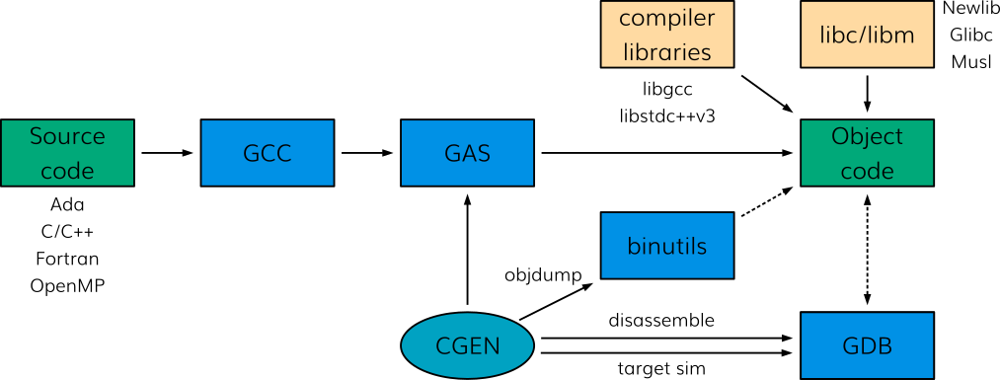

# OpenHW Preliminary Project Proposal: LLVM tool chain for CORE-V

## Summary of project

This proposal is for a baseline development tool chain for CORE-V based on up-to-date compiler and simulation technology, comprising:

- Clang/LLVM tool chain for C and C++:
  - compiler
  - assembler
  - linker
  - emulation library (`compiler-rt`)

The CORE-V LLVM tool chain may rely initially on the GNU CORE-V binutils developed as part of the GNU CORE-V tool chain:
  - assembler (`gas`)
  - linker (GNU `ld`)
  - low level utilities for manipulating object files.

The tool chain will interface to the following other components of the CORE-V development ecosystem:
- GNU debugger (GDB)
- standard C libraries (`newlib`, GNU `_GlibC_`)
- GNU C++ standard library (`libstdc++v3`)

NOTE: Provision of non-(L)GPL C/C++ libraries is beyond the scope of this project.

Because of the scale of the project and the current maturity level of LLVM for RISC-V in general, the LLVM-related work is decomposed into three phases:

1. Support for bare metal use of C with CVA6 (64-/32-bit) together with the _Newlib_ C library;
2. Support for Linux application use of C and C++ with CVA6 (32-/64-bit) together with the _GlibC_ C library; and
3. Support for other RTOSes.

The proposal addresses just the first phase. Other phases will be the subject of separate proposals. Phase 1 will provide the following:

- suitability of Clang/LLVM for HW verification of CVA6:
  - seamless support of multiple datapath widths (multi-XLEN support);
  - resolution of functional failures identified on the current CVA6 verification flow.

- support of differentiating characteristics of the CVA6 cores:
  - pipeline depth,
  - specific CSRs.

- support for a generic CORE-V instruction set extension interface:
  - in the Clang/LLVM tool chain.
  - NOTE: this will provide a commercial driver for future tool chain development for new extensions, whether public or proprietary.

In order to support the Software TG's primary goal of developing a thriving commercial ecosystem, only a basic implementation will be provided.
By basic implementation we mean that:
- the assembler/linker will support the instructions;
- the compiler will have intrinsic (builtin) function support;
- the compiler will have patterns to generate the instructions from C code in obvious circumstances.

There will be no attempt to provide compiler optimizations.  The development of optimizations will be under the responsibility of:
- software companies which can rely on the amount of work still needing to be done to drive their businesses; and of
- HW and system integration companies which can use specific optimizations targeted at their products as market differentiators.

In order to support the Software TG secondary goal of upstreaming all open source tool developments:
- all Clang/LLVM development will be kept compliant with the LLVM Foundation coding and quality assurance standards;
- the implementation will follow the upstream tool design and coding conventions; and
- any vendor-specific modifications or additions will be duly isolated into extensions, so as to maintain a fully functional common open source code base.

Finished LLVM-related work that is not vendor-restricted will be contributed to the LLVM community and maintained upstream.

### Nature of the development

This project requires the modification of a set of existing public open source code bases maintained as projects of the LLVM Foundation and the REMS project.  Therefore, the processes used within OpenHW will reflect the processes of those upstream projects.

The code base of LLVM is of substantial size:

- Clang: 1.75 MLOC C++;
- LLVM: 2.1 MLOC C++.

The LLVM code base includes substantial regression test suites (1.5 MLOC including `libcxx` C++ library tests), and success with these test suites is a pre-requisite of upstream acceptance of any patch.

Until CORE-V related contributions are accepted upstream, code will be developed in narrow mirrors of upstream repositories, featuring a single branch based on upstream top of tree.  This will be used as the basis of the patches to be submitted for upstreaming.

<!--- Partners may maintain local backport branches for corrections to official releases used in their internal HW development flows. --->

Once CORE-V contributions are accepted upstream, common CORE-V specific code for LLVM will be developed and maintained in upstream `llvm.org` repositories.  However, dedicated extensions may continue to be developed in member-owned repositories tracking the upstream repository.

### Summary timeline

- Preliminary Project Launch (PPL, this document): TBD
  - includes project plan

- Project Launch (PL): TBD
- First OHG release (CVA6 64/32 bits, HW verification equivalence to GCC): TBD
- Upstreaming of first release: 2021 H1, targeting LLVM 13.0.

The schedule of LLVM releases follows a six-month cycle which additionally depends on the progress of on-going releases.  This makes the scheduling of upstream contributions more flexible (and also more difficult to schedule upfront).

## OpenHW members/participants committed to participate in this project

All OpenHW Group members are invited to contributed expertise to this project. At present we are aware of the interest and commitment of:

1. Thales
2. Embecosm

## Project Manager and technical lead

- TBD

This is a much lighter role than a traditional project manager, since the requirements are fully defined through the hardware design process.  The primary roles will be:
 tracking and reporting status to OpenHW Software TG and Technical WG;
- identifying and resolving issues related to the outcome.

## Project documents

The following project documents will be created:
- Preliminary Project Proposal (this document)

  - including an initial project plan
  - including an initial risk register

- Project Proposal, an updated version of this document

  - separate detailed project plan
  - separate risk register

## Virtual customer

It is proposed that the OpenHW Group Cores TWG acts as a "virtual customer" to exercise the compiler as it is developed.  In particular, the CVA6 project will exercise the multi-XLEN and core functionality of the LLVM compiler in the CVA6 verification flow.

In addition, while the tool chain will have been thoroughly tested, it will benefit from the OpenHW Group Cores TWG being able to use it with their reference applications.

## Summary of requirements

The requirements for the CVA6 platform are captured in (link TBD).

## Explanation of why OpenHW should do this project

A processor is only useful with a robust, up-to-date, proven compiler tool chain.  CORE-V, being a strict RISC-V derivative, can use a standard RISC-V compiler tool chain, but in these circumstances will not be able to take advantage of any of the added features of the CORE-V processors.  This project will provide a baseline tool chain allowing these features to be used (albeit without optimization) and simulated from the source code level.

Furthermore, the licensing scheme of LLVM (Apache license) makes it particularly appealing to industrial players.  Because it does not require the disclosure of compiler source code, chip manufacturers and system integrators can better protect their differentiating Intellectual Property assets.  This licensing scheme also creates additional opportunities for software companies which can provide high added-value services in the area of compiler tuning for hardware/system-centric companies.

## Industry landscape

The "original" compiler used for the development of RISC-V cores is GCC.  However, LLVM offers a licensing scheme that is more appealing to the processor industry as it does not require the disclosure of critical vendor-specific intellectual property (IP) when distributing the software.  LLVM-based compiler chains appear to be at the foundation of many market leader offerings and it is expected that this will also be the case for RISC-V / CORE-V solutions.

### Related efforts to be described

The upstream LLVM tool chain project already supports standard RISC-V, including all ratified ISA extensions.  RISC-V support in LLVM is strongly compliant to the RISC-V specification, but relatively immature in comparison to other architectures as x86, Arm and MIPS.

Currently LLVM does not support CORE-V specific features or extensions, and subsequently, its test suites do not include any CORE-V or PULP-specific tests.

Other toolchains available for RISC-V are:
- the GNU tool chain for RISC-V, for which a CORE-V specific project is being set up within OpenHW Group;
- IAR RISC-V compiler

The GNU tool chain project within OpenHW Group intends to support CORE-V and PULP extensions, but at the time of writing focuses solely on the CV32E40P platform.

An OHG architecture project devoted to the CVA6 (Ariane) family of cores has passed the PPL gate.  There is a clear synergy between this project and the CVA6 project:
- CVA6 hardware design and verification will directly benefit from the LLVM work;
- in return, the CVA6 project will directly provide inputs (specifications, documentation) for the compiler- and simulator-related activities in the present project.

## External dependencies

Prequisites:
- all the upstream tool sources
- a suitable platform for regression testing the compiler.
- agreement on the instruction set encodings to be compliant with the RISC-V standard.

External dependencies:
- ongoing tracking of upstream LLVM development until the CORE-V tool chain is accepted upstream.

## List of project outputs (deliverables)

## Project deliverables

### Final deliverables

1. extensions to upstream LLVM compiler tools to support CORE-V;
2. revisions to the CORE-V design specifications to clarify ambiguities.

### Interim deliverables

1. Reports on progress to the monthly SW TG:
   - progress against work packages;
   - regression test results;
   - updates to the project plan; and
   - updates to the risk register.
2. Continuously updated source code as new features are added.

## TGs impacted/resource requirements

The Software TG will be responsible for oversight of the planning and delivery of this project.

## OpenHW engineering staff resource plan: requirement and availability

- Duncan Bees - program management oversight

## Engineering resource supplied by members - requirement and availability

TBD

*Note:* This is effort by experienced LLVM compiler tool chain / OCaml specialist engineers.

## OpenHW marketing resource - requirement and availability

- press release support if/when CORE-V support is accepted upstream.

## Marketing resource supplied by members - requirement and availability

- No resource requirements yet identified

## Funding supplied by OpenHW - requirement and availability

- None proposed

## Funding supplied by members - requirement and availability

- An alternative to support in kind is funding of effort by Thales and Embecosm.

## Architecture diagram

The standard LLVM tool chain components are shown in the following diagram.

## Who would make use of OpenHW output

See [Explanation of why OpenHW should do this project](#explanation-of-why-openhw-should-do-this-project)

## Project license model

Each component will use the license of the corresponding upstream RISC-V component.

## Description of initial code contribution, if required

- a GNU tool chain with support for CORE_V open hardware loop supplied by Embecosm.

## Repository structure

The respositories are mirrors of the upstream repositories.

## Project distribution model

The delivered code will be distributed as part of the upstream projects.

Pending upstream adoption, the source code for the components will be available through mirror repositories under OpenHW Group GitHub.

## Preliminary risk register

This will become a separate document at full project launch.

Risk is scored as likelihood (1-10) x impact (1-3) with mitigation required for any risk with score of 10 or more, of with an impact of 3 (project killer).

| Risk                          |   L |   I |   R | Mitigation                 |
|:----------------------------- | ---:| ---:| ---:|:---------------------------|
| Insufficient resource available | 5 | 3 | 15 | Socialize around OpenHW members to find expertise or funding. |

## Preliminary project plan

TBD
