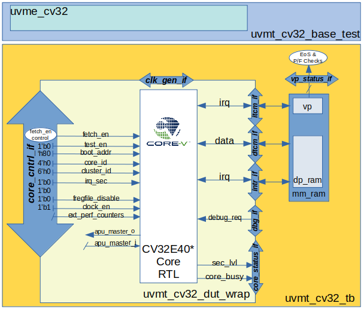
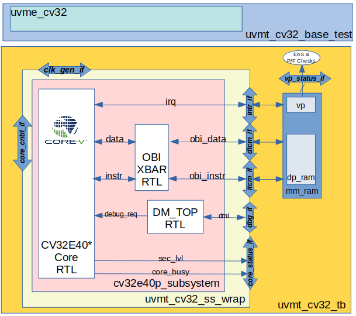

.. _cv32_env:

CV32E40P Simulation Testbench and Environment
=============================================

As stated in the :ref:`pulp-verif` chapter (in the :ref:`exec_summary`),
CV32E40P verification will
follow a two-pronged approach using an updated RI5CY testbench,
hereafter referred to as the core testbench in parallel with the
development of a UVM environment. The UVM environment will be developed
in a step-wise fashion adding ever more capabilities, and will always
maintain the ability to run testcases and regressions.

The UVM environment will be based on the verification environment
developed for the Ibex core, using the Google random-instruction
generator for stimulus creation, the Imperas Instruction Set Simulator
(ISS) for results prediction and will also be able to run hand-coded
code-segments (programs) such as those developed by the RISC-V Compliance Task
Group.

The end-goal is to have a single UVM-based verification environment
capable of complete CV32E40P and CV32E40 verification. This environment
will be rolled out in three phases as detailed below.

Core Testbench
--------------

The “core” testbench, is essentially the RI5CY testbench
(shown in Illustration 1 of :ref:`PULP-Platform Simulation Verification`) with some
slight modifications. It is named after the directory is it located in. This
testbench has the ability to run the directed, self-checking RISC-V Compliance
and XPULP test programs (mostly written in Assembler) used by RISC-V and will
be used to update the RISC-V Compliance and add XPULP Compliance testing for
the CV32E40P.  These tests are the foundation of the `Base Instruction
Set <https://github.com/openhwgroup/core-v-docs/tree/master/verif/CV32E40P/VerificationPlan/base_instruction_set>`__
and `XPULP Instruction
Extensions <https://github.com/openhwgroup/core-v-docs/tree/master/verif/CV32E40P/VerificationPlan/xpulp_instruction_extensions>`__
captured in the CV32E40P verification plan.

The testbench has been modified in the following ways:

1. Fix several Lint errors (Metrics dsim strictly enforces the IEEE-1800
   type-checking rules).
2. Update parameters as appropriate.
3. Some RTL files were placed in the core director – these have been
   moved out.
4. Support UVM error messages.
5. (TBD) Updates to the end-of-simulation flags in the Virtual
   Peripherals.

The CV32E40\* UVM Verification Environment
------------------------------------------

This sub-section discusses the structure and development of the UVM
verification environment under development for CV32E40\*. This
environment is intended to be able to verify the CV32E40P and CV32E40
devices with only minimal modification to the environment itself.

Phase 1 Environment
~~~~~~~~~~~~~~~~~~~

The goal of the phase 1 environment are to able to execute all of the
compliance tests from the RISC-V Foundation, PULP-Platform and OpenHW
Group, plus a set of manually written C and assembler testcases in a
minimal UVM environment. Essentially, it will have the same
functionality as the core testbench, but will all the overhead of the
UVM.

Recall from the structure of the core testbench. Swapping out the RI5CY
RTL model for the CV32E40P RTL model, and adding SystemVerilog
interfaces yields the testbench components for the phase 1 environment.
Rounding out the environment is a minimal UVM environment and UVM base
test. This is shown in `Illustration 4`_.

.. figure:: ../images/CV32E_VE_phase1.png
   :name: Illustration 4
   :align: center
   :alt: 

   Illustration 4: Phase 1 CV32E40P UVM Environment

The testbench components of the phase 1 environment are the so-called
“DUT wrapper” (module uvmt\_cv32\_dut\_wrap) which is a modification of
the riscv\_wrapper in core testbench, and the “testbench” (module
uvmt\_cv32\_tb) which is a replacement of the tb\_top module from the
core testbench. This structure provides the UVM environment with access
to all of the CV32E40P top-level control and status ports via
SystemVerilog interfaces. Note that for phase 1, most of the control
inputs are static, just as they are in the core testbench. The phase 2
environment will have dedicated UVM agents for each of the interfaces
shown in , allowing testcases to control these interfaces using UVM test
sequences.

The phase 1 environment will also control the function of the riscv-gcc
toolchain directly as part of the UVM run-flow, simplifying the
Makefiles used to control compilation and execution of testcases.

Phase 2 Environment
~~~~~~~~~~~~~~~~~~~

The phase two environment is shown in `Illustration 5`_. Phase 2 introduces the `Google
Random Instruction Generator <https://github.com/google/riscv-dv>`__ and
the `Imperas
ISS <http://www.imperas.com/articles/imperas-empowers-riscv-community-with-riscvovpsim>`__
as a stand-alone components. The most significant capabilities of the
phase 2 environment are:

-  Ability to use SystemVerilog class constraints to automatically
   generate testcases.
-  Results checking is built into the environment, so that testcases do
   not need to determine and check their own pass/fail criteria.
-  Simple UVM Agents for both the Interrupt and Debug interfaces. ToDo:
   show this in the Illustration.
-  Ability to run any/all testcases developed for the Phase 1
   environment.
-  Support either of the CV32E40P or CV32E40 with only minor
   modifications.

.. figure:: ../images/CV32E_VE_phase2.png
   :name: Illustration 5
   :align: center
   :alt: 

   Illustration 5: Phase 2 Verification Environment for CV32E

As shown in `Illustration 5`_, the environment is not a single entity.
Rather, it is a collection of disjoint components, held together by
script-ware to make it appear as a single environment. When the user
invokes a command to run a testcase, for example, make
xrun-firmware [10]_, a set of scripts and/or Makefile rules are
invoked to compile the environment and test(s), run the simulation(s)
and check results. The illustration shows the most
significant of these:

-  **make gen**: this is an optional step for those tests that run
   stimulus generated by the Google random instruction generator. Tests
   that use manually generated or externally sourced tests will skip
   this test. The generator produces an assembly-language file which is
   used as input to *asm2hex*.
-  **make asm2hex**: this step invokes the SDK (riscv-gcc
   tool-chain) to compile/assemble/link the input program into an ELF
   file. The input program is either from the *make gen* step
   or a previously written assembler program. The ELF is translated
   to a hexfile, in verilog “memh” format, that can be loaded into a
   SystemVerilog memory.
-  **make sv-sim**: this step runs a SystemVerilog simulator that
   compiles the CV32E and its associated testbench. As with the RI5CY
   testbench, the asm2hex generated hexfile is loaded into Instruction
   memory and the core starts to execute the code it finds there.
   Results are written to an *actual* results output file.
-  **make iss-sim**: this step compiles and runs the
   Instruction Set Simulator, using the same ELF
   produced in the *make asm2hex step*. The ISS thereby runs
   the same program as the RTL model of the core and produces an
   *expected* result output file.
-  **make cmp**: here a simple compare script is run that
   matches the actual results produced by the RTL with the expected
   results produced by the ISS. Any mismatch results in a testcase
   failure.

Phase 2 Development Strategy
~~~~~~~~~~~~~~~~~~~~~~~~~~~~

The disjoint-component nature of the phase two environment simplifies
its development, as almost any component of the environment can be
developed, unit-tested and deployed separately, without a significant
impact on the other components or on the phase one environment. In
addition, the Ibex environment provides a working example for much of
the phase two work.

The first step will be to introduce the random-instruction generator
into the script-ware. This is seen as a relatively simple task as the
generator has been developed as a stand-alone UVM component and has
previously been vetted by OpenHW. Once the generator is integrated,
user’s of the environment will have the ability to run existing or new
testcases for the phase one environment, as well has run generated
programs on the RTL. The programs generated by the Google
random-instruction generator are not self-checking, so tests run with
the generator will not produce a useful pass/fail indication, although
they may be used to measure coverage.

In order to get a self-checking environment, the ISS needs to be
integrated into the flow. This is explicitly supported by the Google
generator, so this is seen as low-risk work. An open issue is to extract
execution trace information both the RTL simulation and ISS simulation
in such a way as to make the comparison script simple. Ideally, the
comparison script would be implemented using ***diff***. This is a
significant ToDo.

Phase 3 Environment
~~~~~~~~~~~~~~~~~~~

Phase 3 adds significant capabilies to the environment, notably the integration
of the ISS as an environment component and a **Step-and-Compare** instruction scoreboard.

ISS Integration
________________

`Illustration 5`_ shows the ISS as an entity external to the environment.  Wrapping
the ISS in a DPI layer allows the ISS to be integrated into the UVM environment
and thus controllable via the UVM run-flow.  The benefit of this is that testcases
will have direct control over the operation of the ISS and comparision between the
predictions made by the ISS and actual instruction execution by the Core are
done in real time.  This is a significant aid to debugging failures.

Step-and-Compare Scoreboarding
______________________________

To Do

Beyond Phase 3 Environment
~~~~~~~~~~~~~~~~~~~~~~~~~~

At the time of this writing (2020-04-21) there is a proposal to develop a
CV32E40P Subsystem, comprized of the Core, a Debug Module and Debug Transport
Module, plus a cross-bar which will allow for Debug Module and an external AHB
master to access instruction and data memory.  Details of this Subsystem can be
found in the Architecture Specification for the
`Open  Bus Interface <https://github.com/openhwgroup/core-v-docs/blob/master/cores/cv32e40p/OBI-v1.0.pdf>`__.

`Illustration 6`_ shows a simple (?) change to the **uvmt_cv32_tb** that allows
the testbench (and thereby the UVM enviroment) to switch between a Core-level
DUT and a Subsystem-level DUT.

Here, the memory model **mm_ram** has been moved from the dut_wrap module to
the testbench module.  The connection between the memory model and the dut_wrap
is via new SystemVerilog interfaces, **itcm** and **dtcm**.  These SystemVerilog
interfaces support both the Core-level instruction and data interfaces as well
as the OBI instruction and data interfaces.  This is possible because the OBI
standard is a super-set of the Core's interfaces.  Any difference in operation
between these interfaces is controlled at compile time [11]_.

   Illustration 6: Moving Memory Model to the Testbench

In `Illustration 7`_ the **uvmt_cv32_dut_wrap** (or core wrapper) is replaced with
**uvmt_cv32_ss_wrap** (subsystem wrapper).  This subsystem wrapper has the same
SystemVerilog interfaces as the core wrapper and instantiates the CV32E40*
Subsystem directly.  For Core-level testing, the the OBI XBAR and DM_TOP modules
are replaced with "shell" modules at compile-time.  The XBAR shell is a pass-through
for the instruction and data buses to directly connect to
itcm_if and dtcm_if respectively.  Likewise, the DM is also replaced with a shell
that drives Hi-Z on its debug_req output, thereby allowing debug_req to be driven
directly from the dbg_if.  The DM shell drives the ready output on the DMI low to
ensure that the Debug Agent (in the UVM environment, not shown in the Illustration)
does not inadvertently attempt debug access via the DMI.  Instead, the Debug Agent
is configured to drive debug_req directly.

Testing the Subsystem involves no compile-time changes to the UVM environment
as it is able to use the same SystemVerilog interfaces.  The run-time configuration
is changed such that the Debug Agent drives Hi-Z on its debug_req ouput and all
accesses to the DM use the DMI signalling.   At compile-time the RTL for the
OBI XBAR and DM modules are instantiated.  The AHB master and slave interfaces
of the Subsystem (not shown in the Illustration) connect to their own SystemVerilog
interfaces which connect to AHB Agents in the UVM environment.  If the wrapper has
been compiled to instantiate just the Core, these AHB Agents are configured to
be inactive.

   Illustration 7: Subsystem Wrapper (compiled for Core-level verification)

File Structure and Organization
-------------------------------

ToDo

Naming Convention
~~~~~~~~~~~~~~~~~

Directory and File Structure
~~~~~~~~~~~~~~~~~~~~~~~~~~~~

Compiling the Environment
~~~~~~~~~~~~~~~~~~~~~~~~~

.. [10]
   See the README at
   https://github.com/openhwgroup/core-v-verif/tree/master/cv32/tests/core
   to see what this does. Note that the User Manual for the Verification
   Environment, which explains how to write and run testcases, will be
   maintained there, not in the
   `core-v-docs <https://github.com/openhwgroup/core-v-docs/tree/master/verif>`__\ project
   which is home for this document.

.. [11]
   The memory model is currently implemented as a SystemVerilog module.  Replacing
   this with a SystemVerilog class based implementation would allow for run-time
   control of the SystemVerilog interface operation.  This is a nice-to-have
   feature and is not, on its own, enough of a reason to re-code the memory model.

